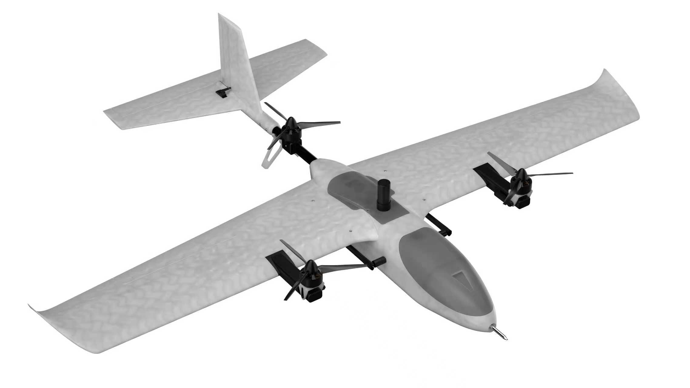
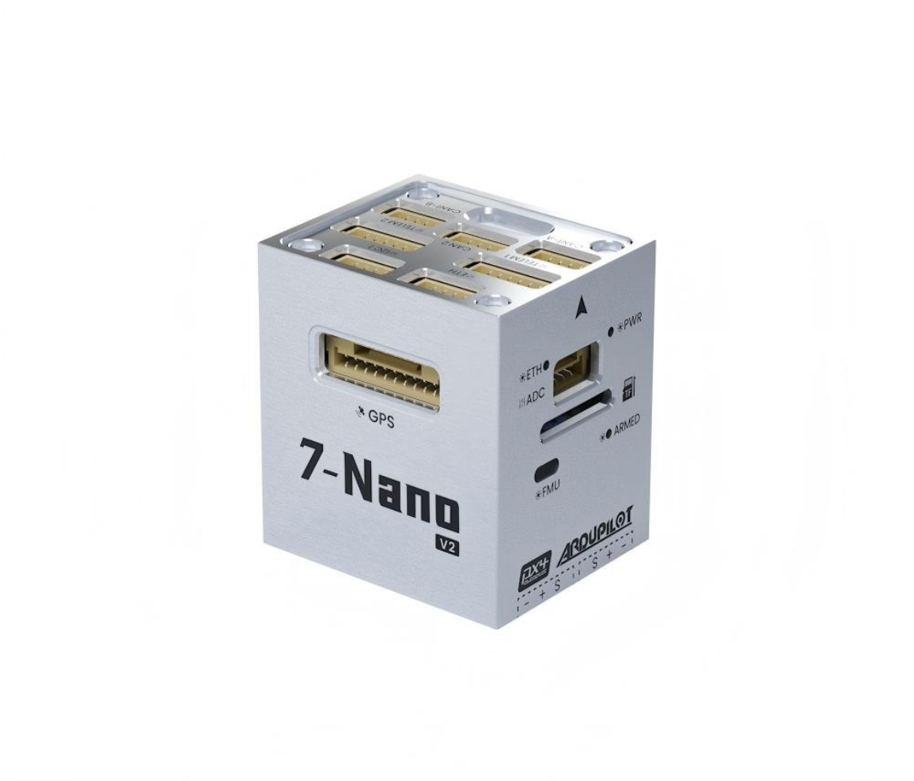
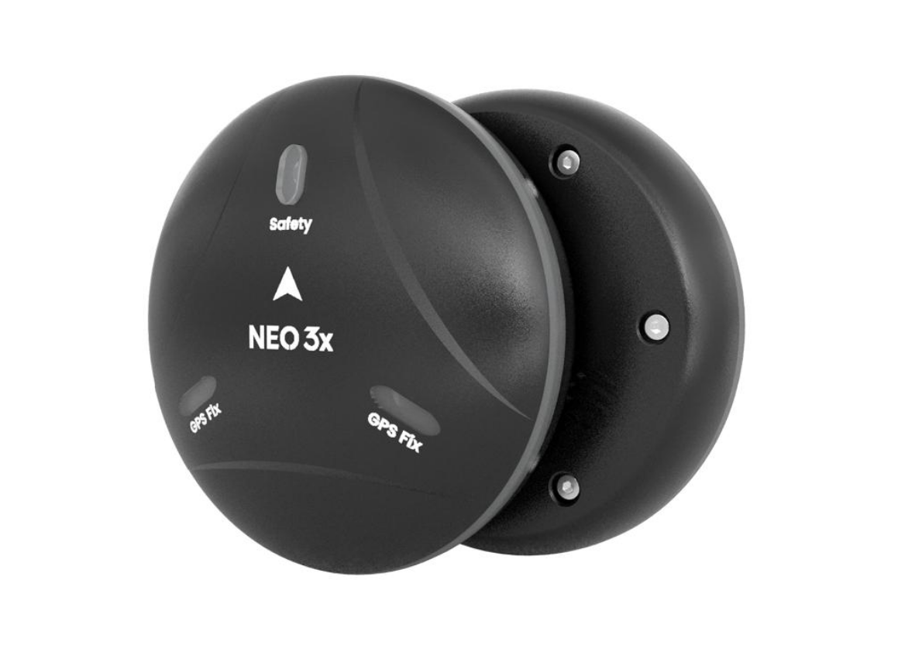
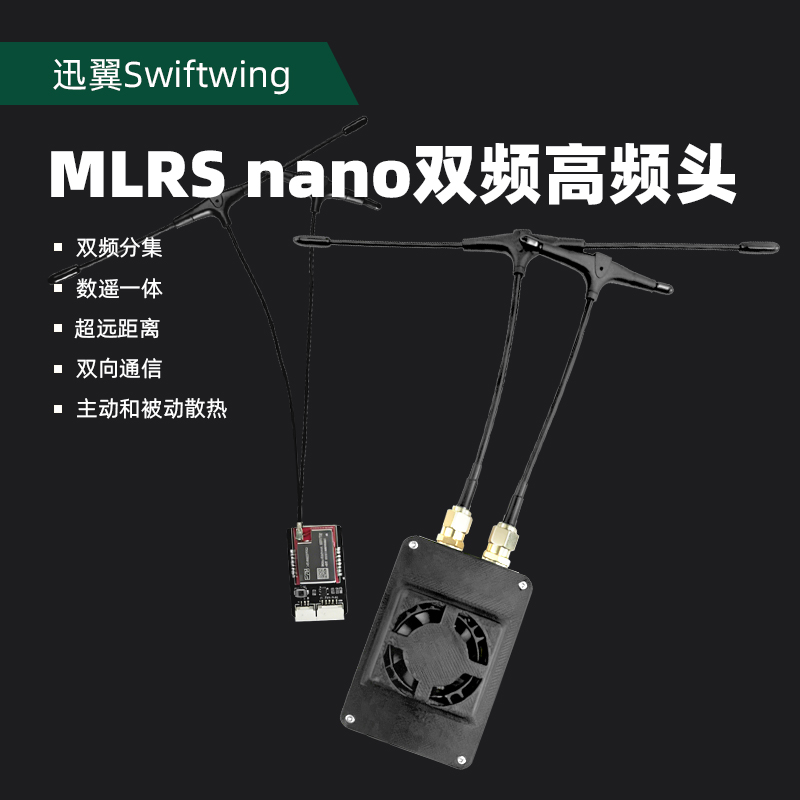
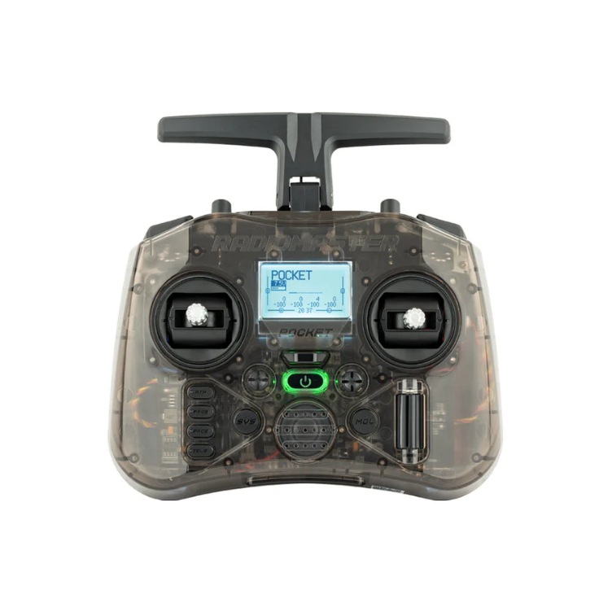
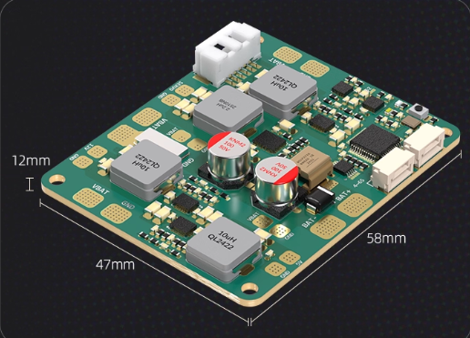
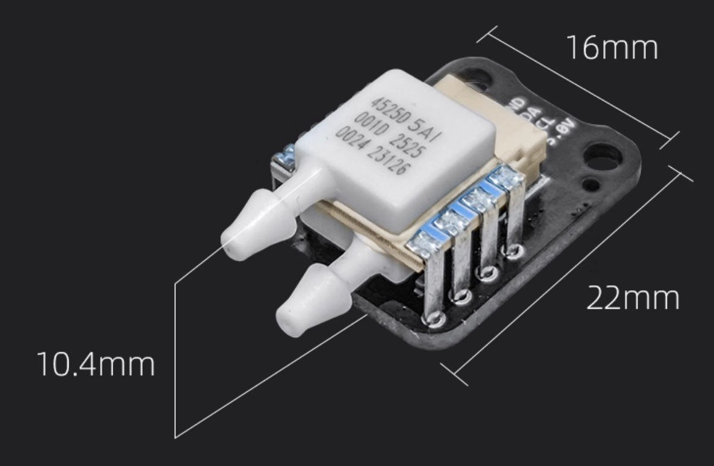
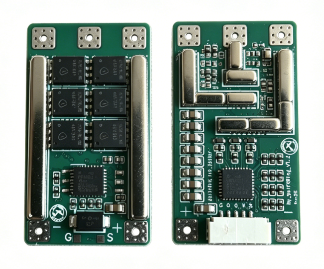

# S6硬件介绍

## 1.技术规格

### S6产品视图

| 参数         | 数值                  |
| ------------ | --------------------- |
| 重量         | 2.8kg(含电池，含负载) |
| 尺寸         | 1400*1000*255mm     |
| 最大起飞重量 | 3.5kg                 |
| 续航         | 30min                 |
| 抗风等级     | 4级                   |
| 工作温度     | -10~40°C             |

## 2.硬件介绍

### ① 飞控

#### Nora+飞控

| 参数         | 数值                                    |
| ------------ | --------------------------------------- |
| 主处理器     | STM32H753 Arm® Cortex®-M7 480 MHz 2MB Flash |
| 加速计       | IIM-42652/IIM-42653                     |
| 陀螺仪       | IIM-42652/IIM-42653                     |
| 电子罗盘     | IIS2MDCTR                               |
| 气压计       | ICP-20100/BMP581                        |
| 重量         | 33g                                     |
| 尺寸         | 30.5 × 25.5 × 31.8 mm                   |

### ② GPS

#### NEO 3X

| 参数           | 数值                                      |
| -------------- | ----------------------------------------- |
| 处理器         | STM32F412                                 |
| 通信协议       | DroneCAN                                  |
| 电子罗盘       | RM3100                                    |
| 气压计         | ICP-20100                                 |
| 卫星接收器     | Ublox M9N                                 |
| 工作频段       | GPS: L1C/A ` `GLONASS:L10F ` `北斗:B1I ` `Galileo:E1B/C |
| 并发器数量     | 4                                         |
| 定位精度       | 1.5m(实测最高0.7m)                        |
| 搜星数量       | 32+                                       |
| 捕获速度       | 冷启动 24S ` `再次捕获 2S ` `辅助启动 2S |
| 导航刷新率     | 5Hz(默认)，最大25Hz                       |
| 灵敏度         | 追踪 & 导航：-167dBM ` `冷启动: -148dBM ` `热启动：-159dBM ` `重新捕获: -160dBM |
| 防护等级       | IP66                                      |
| 工作电压       | 4.7~5.2V                                  |
| 工作温度       | -10~70℃                                   |
| 尺寸           | 67*67*21.2mm                              |
| 重量           | 46g(不含电缆）                            |

### ③ 数传

| 参数           | 数值                                             |
| -------------- | ------------------------------------------------ |
| 最大通讯距离   | 5km                                             |
| 通讯通道       | 16个                                             |
| 数传支持飞控   | PIX、APM、雷迅或其他任何带UART数据传输功能的飞控 |
| 图传支持地面站 | QGC、MissionPlane等                                  |

### ⑤ 遥控器
[Pocket遥控器](https://cdn.shopify.com/s/files/1/0701/8066/7584/files/Pocket_A1.8.pdf?v=1770617495)    

| 参数              | 数值                                                                                                 |
| ----------------- | ---------------------------------------------------------------------------------------------------- |
| 物品              | Pocket Radio                                                                             |
| 外形尺寸          | 156.6\*65.1\*125.3mm（折叠尺寸）/156.6\*73.1\*154.8mm（展开尺寸）                                     |
| 重量              | 288克                                                                                                |
| 工作频率          | 2.400GHz-2.480GHz                                                                                    |
| 内部射频选项      | CC2500多协议/ ELRS 2.4GHz                                                                             |
| 支持的协议        | 依赖于模块                                                                                           |
| 工作电压          | 6.6-8.4v DC                                                                                          |
| 操作系统          | EdgeTX                                                                                               |
| 控制通道          | 最大16个（依赖于接收器）                                                                             |
| 显示屏            | 128\*64单色液晶                                                                                       |
| 电池              | 2节18650电池（不含）                                                                                 |
| 充电方式          | 内置USB-C QC3充电                                                                                    |
| 可升级固件        | 通过USB或附带的SD卡                                                                                  |
| 云台              | X5霍尔效应，四球轴承，纳米云台（AG01纳米兼容）                                                       |
| 模块舱            | 纳米尺寸（兼容RadioMaster纳米尺寸模块，TBS Nano Crossfire / Nano Tracer）                            |

### ⑥ 分电板

#### 7-Nano PDB电源模块

| 参数         | 数值                          |
| ------------ | ----------------------------- |
| 工作电压     | 12-70V                        |
| 最大测量电流 | 79.2A                         |
| BEC          | 5.3V/4A                       |
| 测量精度     | ±0.2V/0.5A                    |
| 分线器       | 一分六                        |
| 接口         | XT60/GH1.25 6Pin              |
| 重量         | 17g                           |

### ⑦ 空速计

| 参数类别 | 具体参数                     |
| -------- | ---------------------------- |
| 核心传感器 | 4525DO高精度空速传感器       |
| 测量范围 | 0-50m/s                      |
| 适配飞控 | PX4、APM固件飞控             |
| 工作电压 | 5V（飞控直插供电）           |
| 工作温度 | -10℃-85℃                     |
| 产品重量 | 3.7±0.1g（仅模块，不含硅胶管和金属管） |
| 输出信号 | I2C                          |
| 模块尺寸 | 22 * 16 * 10.4                             |

### ⑧ 电调

| 参数类别 | 具体参数 |
| -------- | -------- |
| 型号 | SwiftWing 40A |
| 持续工作电流 | 40A |
| 峰值电流 | 50A |
| 电调回传 | 支持（不支持串口回传） |
| 板载电流计 | 不支持 |
| 板载电容 | 9pcs贴片低ESR陶瓷电容（提供更好滤波效果，有效抑制开关尖峰和噪声，无需外接大电容，系统更稳定） |
| 输入电压 | 3~6s Lipo |
| 主控芯片 | AT32F421K8U7 |
| 尺寸 | 39mm * 21.5mm * 8.3mm |
| 固件类型 | AM32 |
| 协议 | DShot 150/300/600/MultiShot/OneShot etc. |