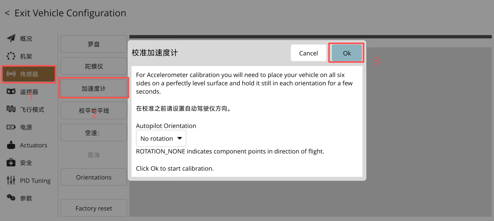
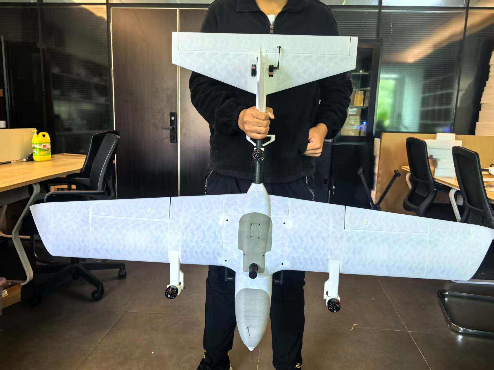
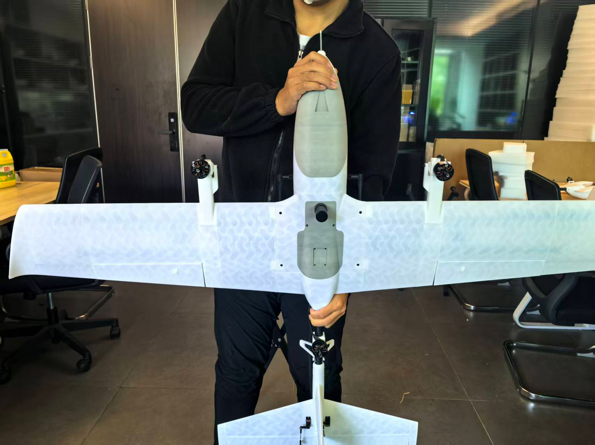
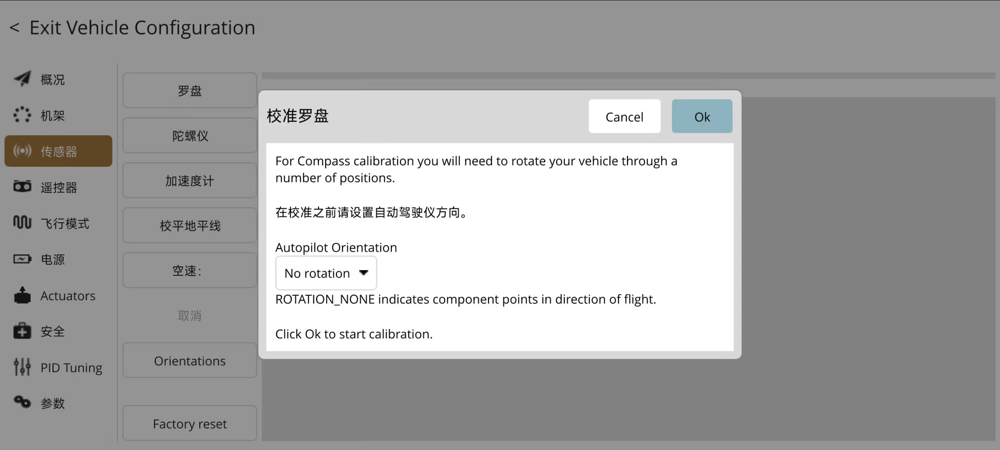
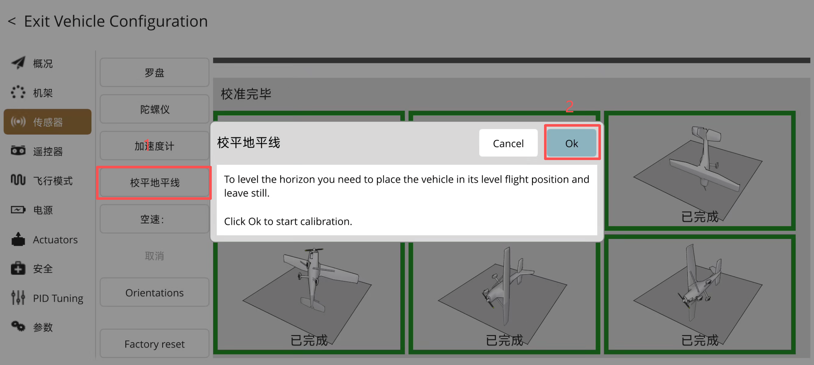
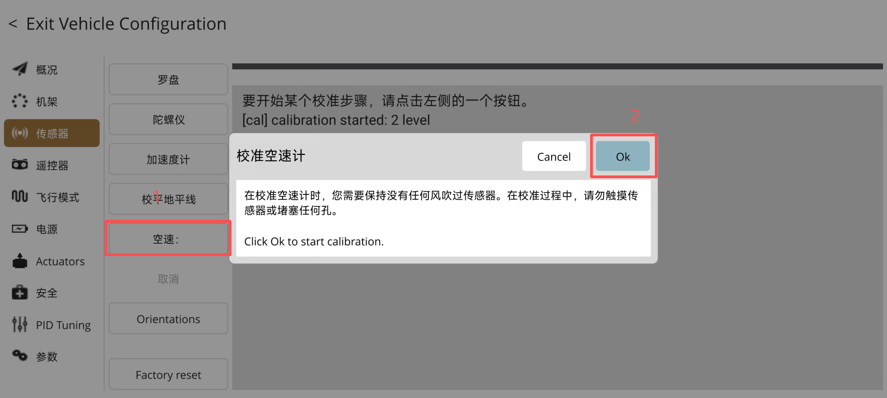

# VtolS6飞控使用教程

## 无线连接VtolS6飞控

* 电脑使用数据线连接SIYI通信链路的USB口即可
* 部分电脑连接通信链路后可以自动连接上飞控，无需配置，如果没有自动连接，则需要手动配置

## 校准VtolS6飞控

* 需要校准的情况：全新飞控刷写固件参数后、硬件变动、飞行状态异常、长时间未使用。

### 加速度计校准

* 保证无人机静止，水平放置。点击QGC左上角图标菜单 -> Vehicle Setup

1. 点击，传感器
2. 点击，加速度计
3. 若机头方向与飞控安装方向一致，点击OK;若机头方向与飞控安装方向不一致，请选择飞控安装方向后进行校准

4. 依图所示摆放无人机姿态后静止，维持图示姿态不动，点击下一步，即完成该姿态校准

* 当黄色方框有黄色变为绿色之后，即可开始下一个无人机姿态的校准
* 待黄框变成绿框校准完成后，根据提示依次重复上述操作，直至完成加速度计校准

* 加速度计校准完成后，会弹出重启无人机的提示，重新上电后，即可完成加速度计校准。

### 罗盘校准

* 保证无人机静止，水平放置。点击QGC左上角图标菜单 -> Vehicle Setup

1. 点击，传感器
2. 点击，罗盘
3. 若机头方向与飞控安装方向一致，则继续步骤;若机头方向与飞控安装方向不一致，请选择飞控安装方向后进行校准
4. 选择你要使用的罗盘，点击OK

* 在每个轴向上随机旋转飞机，一直到进度条完全填满
* 您现在必须重新启动您的飞机，才能使新的设置生效！

### 校准地平线

* 保证无人机静止，水平放置。点击QGC左上角图标菜单 -> Vehicle Setup

1. 点击，传感器
2. 点击，校准地平线
3. 点击，OK

* 要校平地平线，你需要将飞机置于平飞位置，然后点OK

### 校准气压/空速计

* 保证无人机静止，水平放置。点击QGC左上角图标菜单 -> Vehicle Setup

1. 点击，传感器
2. 点击，校平地平线
3. 点击，OK

* 压力校准会将现在的压力读数高度设置为0。要校准空速传感器，需要将它遮住，避免风的干扰。在校准过程中，请勿触摸传感器或堵塞任何孔

# APM相关

* [本文相关教程基于APM官方](https://ardupilot.org/plane/search.html?q=safe&check_keywords=yes&area=default)

## 安全（故障保护）配置

### 故障保护概述

APM（Ardupilot）提供了多种故障保护机制，用于在异常情况下保障飞行器安全。这些故障保护可以在Mission Planner地面站中进行配置。

### 主要故障保护类型

#### 1. 电池故障保护

**电池电压监控**

- **BATT_FS_LOW_VOLT**：低电压故障保护阈值（单位：伏特）
- **BATT_FS_CRT_VOLT**：严重低电压故障保护阈值（单位：伏特）
- **BATT_FS_LOW_ACT**：低电压时的动作（0=禁用, 1=RTL, 2=降落）
- **BATT_FS_CRT_ACT**：严重低电压时的动作（0=禁用, 1=RTL, 2=降落）

**电池电流监控**

- **BATT_MONITOR**：电池监控类型（0=禁用, 3=电压/电流传感器）
- **BATT_CAPACITY**：电池容量（单位：mAh）
- **BATT_LOW_MAH**：低电量阈值（单位：mAh）
- **BATT_CRT_MAH**：严重低电量阈值（单位：mAh）

#### 2. 遥控信号丢失故障保护

- **FS_THR_ENABLE**：油门故障保护启用（1=启用）
- **FS_THR_VALUE**：油门故障保护阈值（低于此值触发）
- **FS_THR_ACT**：油门故障保护动作（0=禁用, 1=RTL, 2=降落, 3=保持高度）
- **RC_TIMEOUT**：遥控信号超时时间（单位：毫秒）
- **FS_RC_ENABLE**：遥控信号丢失故障保护启用（1=启用）
- **FS_RC_ACT**：遥控信号丢失时的动作（0=禁用, 1=RTL, 2=降落, 3=保持高度）

#### 3. 地理围栏故障保护

- **FENCE_ENABLE**：地理围栏启用（1=启用）
- **FENCE_TYPE**：围栏类型（0=禁用, 1=圆形, 2=多边形）
- **FENCE_RADIUS**：圆形围栏半径（单位：米）
- **FENCE_ALT_MAX**：最大飞行高度（单位：米）
- **FENCE_ACTION**：围栏触发动作（0=报告, 1=RTL, 2=降落, 3=保持高度）

#### 4. 空速故障保护

- **ARSPD_FBW_MIN**：最小空速（单位：米/秒）
- **ARSPD_FBW_MAX**：最大空速（单位：米/秒）
- **FS_AIRSPD_ENABLE**：空速故障保护启用（1=启用）
- **FS_AIRSPD_ACT**：空速故障保护动作（0=禁用, 1=RTL, 2=降落）

#### 5. GPS故障保护

- **GPS_FS_ENABLE**：GPS故障保护启用（1=启用）
- **GPS_FS_TIME**：GPS丢失时间阈值（单位：秒）
- **GPS_FS_ACTION**：GPS故障保护动作（0=禁用, 1=RTL, 2=降落, 3=保持高度）

### 故障保护动作说明

| 动作         | 描述               |
| ------------ | ------------------ |
| 0 (禁用)     | 不执行任何操作     |
| 1 (RTL)      | 返回起飞点并降落   |
| 2 (降落)     | 在当前位置降落     |
| 3 (保持高度) | 保持当前高度和航向 |

### 配置方法

1. **使用Mission Planner配置**：

   - 连接飞行器到Mission Planner
   - 点击 "配置" > "全部参数表"
   - 搜索相关参数并设置
2. **推荐配置**：

   - 电池：低电压RTL，严重低电压降落
   - 遥控：信号丢失RTL
   - 地理围栏：超出范围RTL
   - 空速：异常空速RTL

### 安全飞行建议

- 每次飞行前检查所有故障保护设置
- 根据飞行环境调整地理围栏设置
- 确保电池故障保护阈值设置合理
- 定期检查遥控设备电池电量
- 在复杂环境飞行时启用所有相关故障保护
