# 准备通信链路

* 硬件准备为每次飞行都需要进行
* 软件准备为第一次，按照教程配置软件连接。后续飞行，按需调整对应配置即可
* 高频头出厂为无线蓝牙连接，如需有线连接请看[有线连接](#准备通信链路（有线连接）)

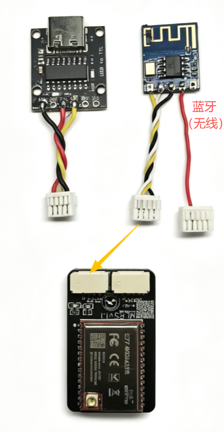

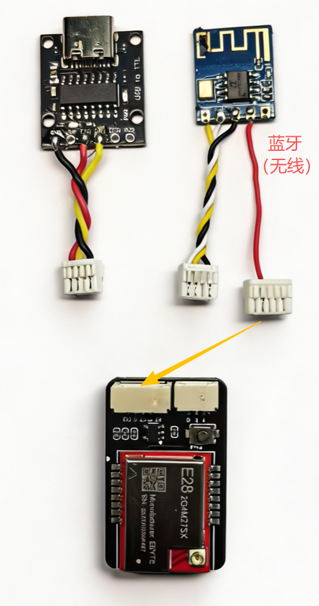

## 硬件准备

1. MLRS高频头
2. 遥控器、接收机
3. VtolS3无人机主体
4. 无人机电池
5. 电脑

### 硬件连接

1. 将转接座对准遥控器高频头卡槽，对准排针，确保安装没有虚位

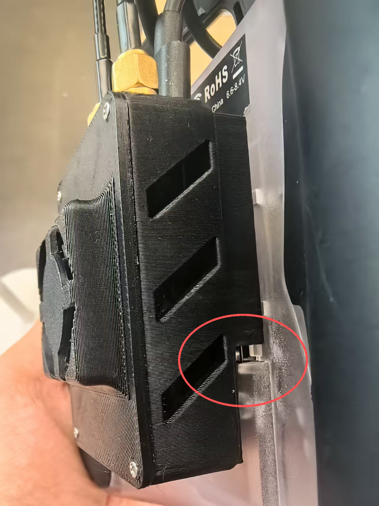

2. 根据高频头上标识，将天线连接到高频头上

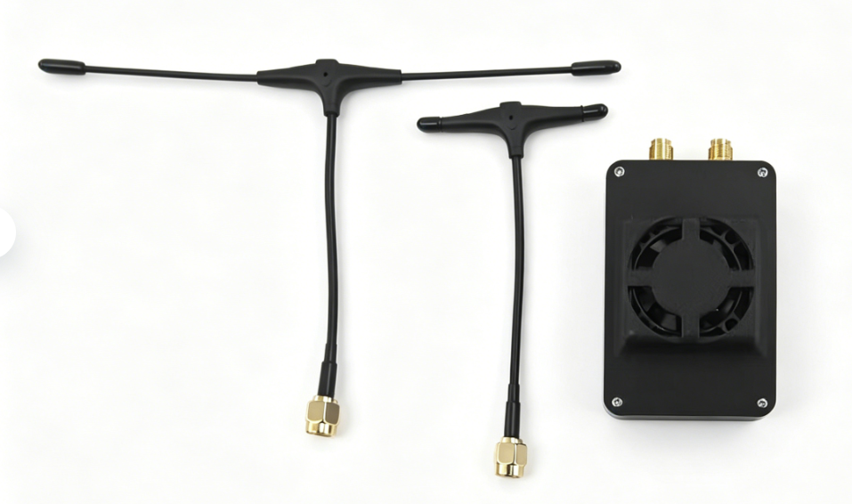

* 高频头上标有对应标识

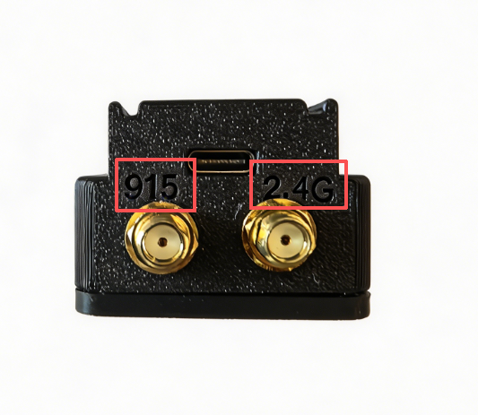

* 对应拧紧天线，确保连接稳定

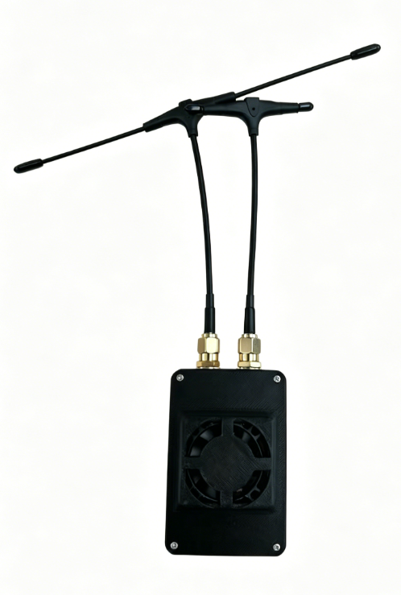

* 另一侧是NANO仓快拆口，用于连接遥控器

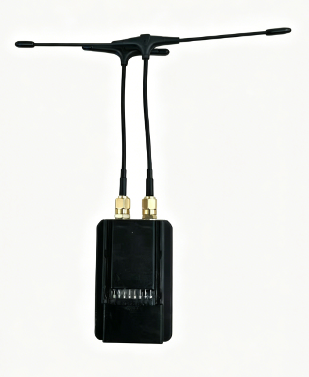

## 软件准备

### 无线连接

**蓝牙连接**

1. 首先打开手机蓝牙，搜索蓝牙设备，找到 "SwiftWingS6XLBT"，点击连接。（若未按步骤配对，地面站可能无法连接）

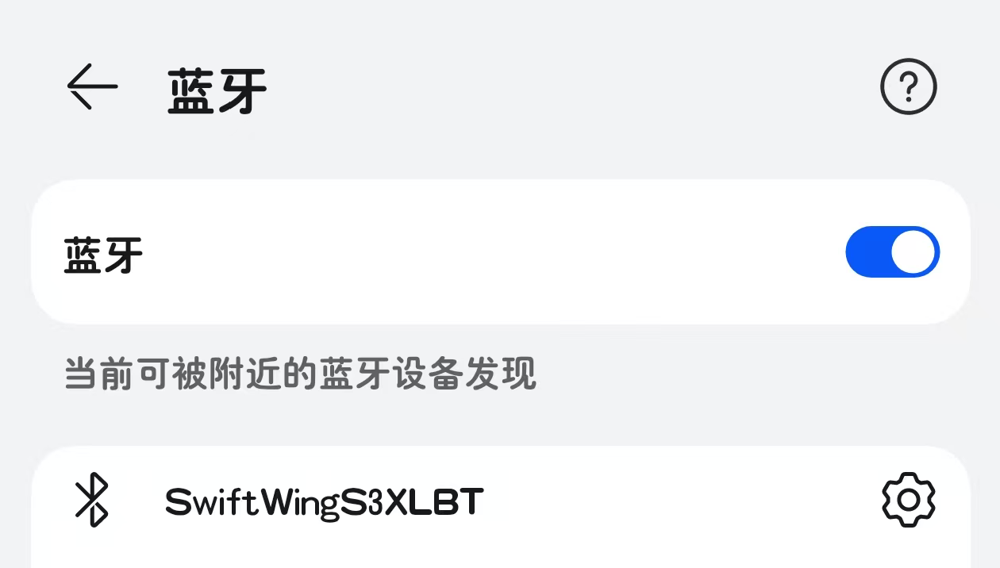

2. 打开手机版QGC，点击QGC图标,选择"Application Settings"。

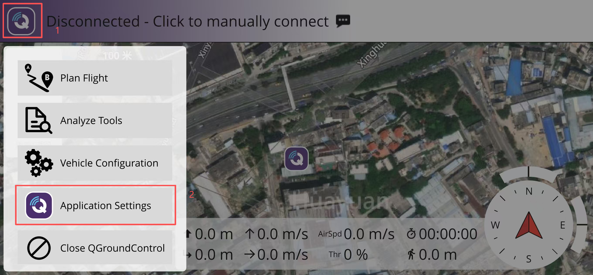

3. 点击”Comm Links“选项，点击”添加”按钮，添加一个新通讯连接。

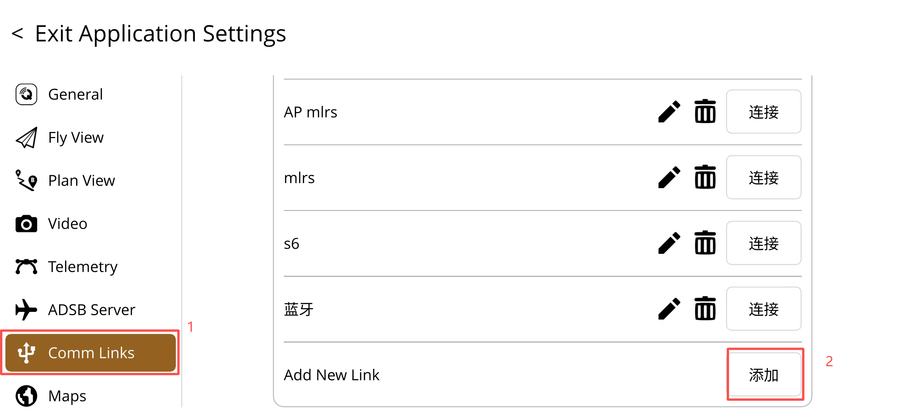

4. 输入通讯连接的名称，例如”SwiftWingS6XLBT“，选择”蓝牙（Bluetooth）“作为连接类型，点击”扫描“按钮。

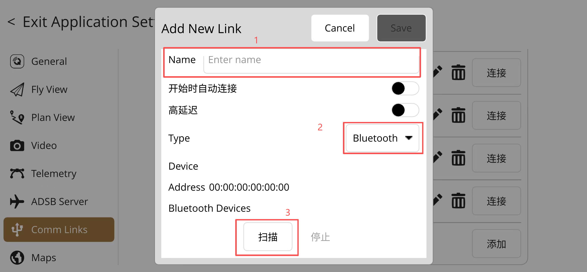

5. 扫描到 “SwiftWingS6XLBT”，点击连接。

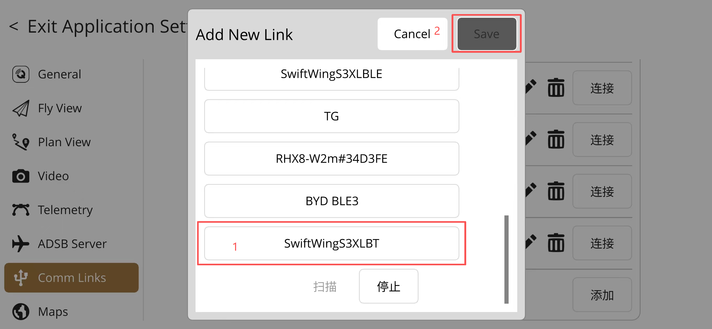
