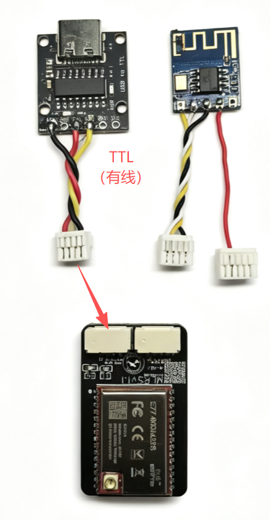
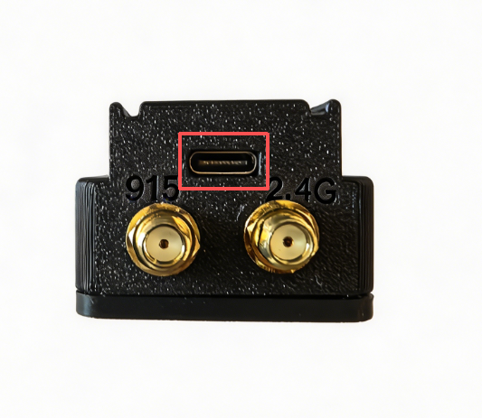
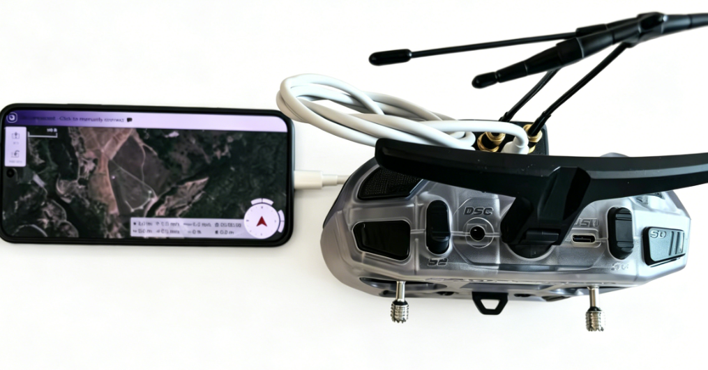
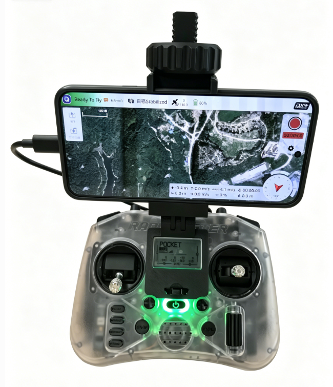
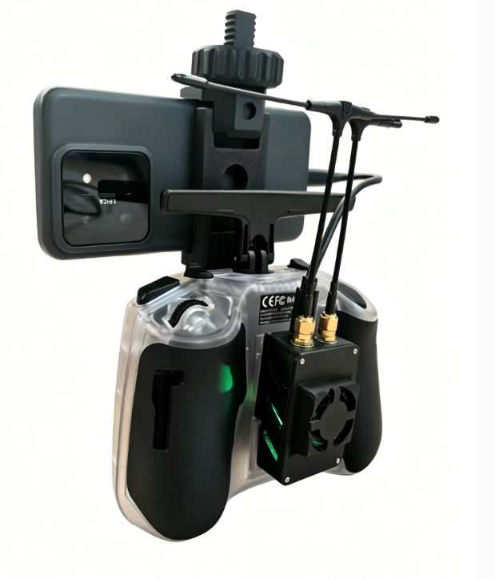
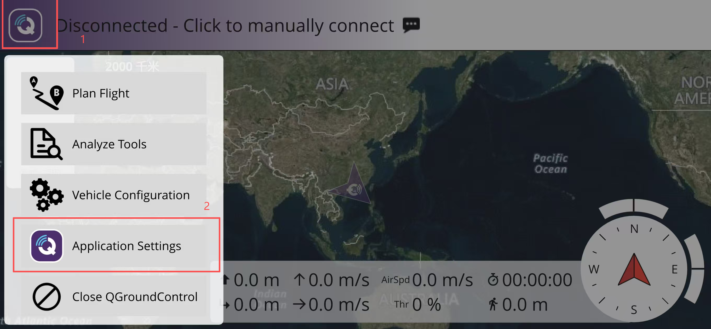
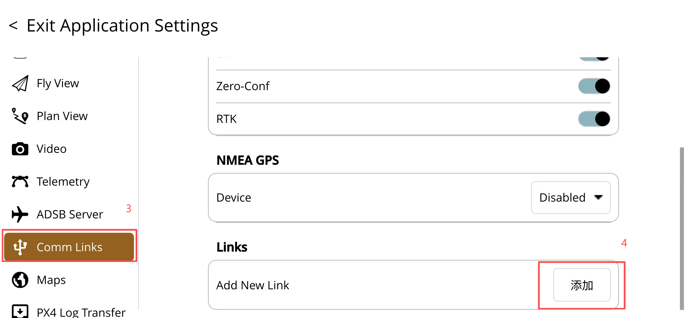
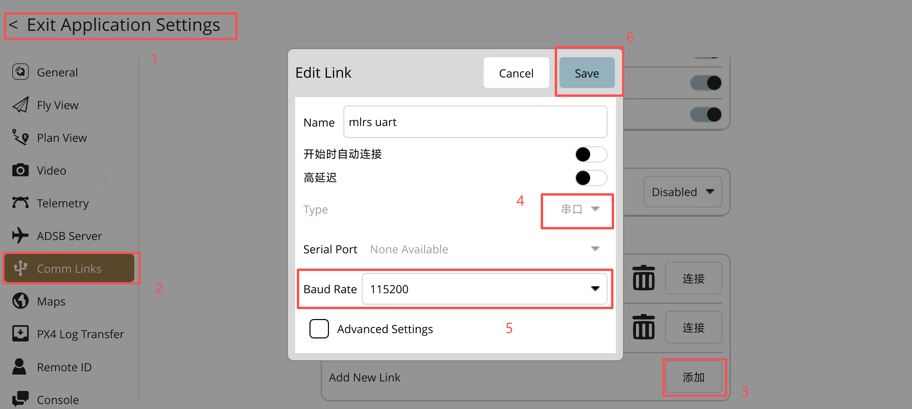
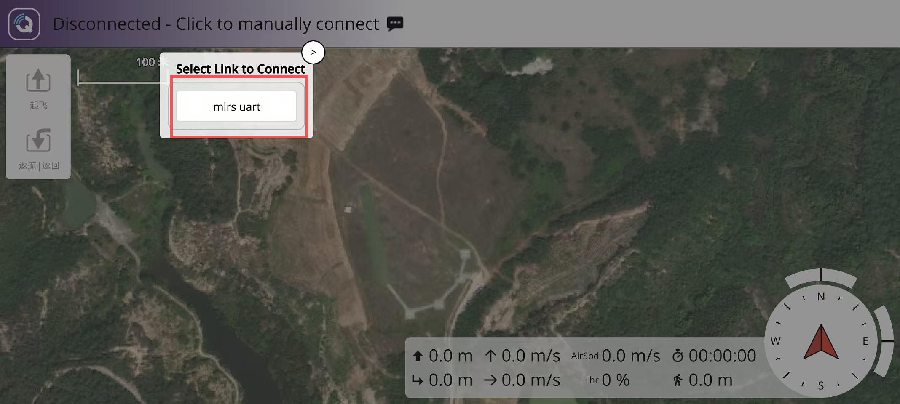
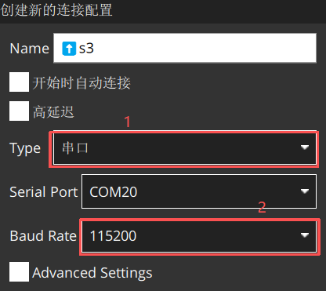

# 准备通信链路

* 硬件准备为每次飞行都需要进行
* 软件准备为第一次，按照教程配置软件连接。后续飞行，按需调整对应配置即可
* 高频头出厂为无线蓝牙连接，有线连接如下：

## 硬件准备

1. MLRS高频头
2. 遥控器、接收机
3. VtolS3无人机主体
4. 无人机电池
5. 电脑

### 硬件连接

1. 将转接座对准遥控器高频头卡槽，对准排针，确保安装没有虚位

2. 根据高频头上标识，将天线连接到高频头上

* 高频头上标有对应标识

* 对应拧紧天线，确保连接稳定

* 另一侧是NANO仓快拆口，用于连接遥控器

3. 通过type-c转type-c数据线将高频头与手机连接

* 如图，使用TypeC To TypeC数据线连接高频头与手机即可

* 可使用手机支架固定手机和遥控器，确保连接稳定

## 软件准备

### 有线连接

**手机连接**

* 手机与高频头连接后，打开手机安卓版QGC软件，点击左上角图标，进入设置界面，下滑找到“通讯连接”选项，点击添加连接，连接类型选择“串口”，波特率改为“115200”

* 添加好名称后，点击保存，再点击连接，即可自动连接上地面站

**电脑连接**

+ 若想连接电脑使用QGC软件，需要先下载[CH340驱动](https://espjs.cn/driver)

* 电脑与高频头连接后，打开电脑版QGC软件，点击左上角图标，进入设置界面，下滑找到“通讯连接”选项，点击添加连接，连接类型选择“串口”，波特率改为“115200”，串口选用连接到高频头后出现的串口，如图：com20

