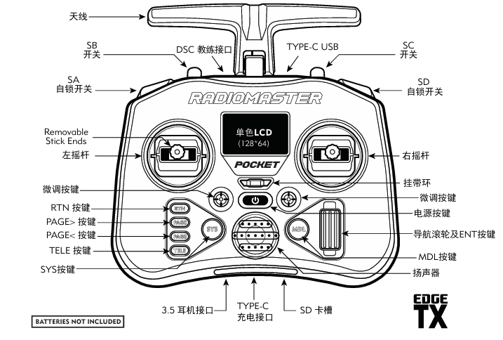
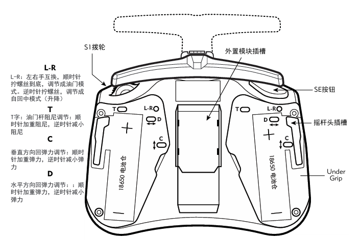
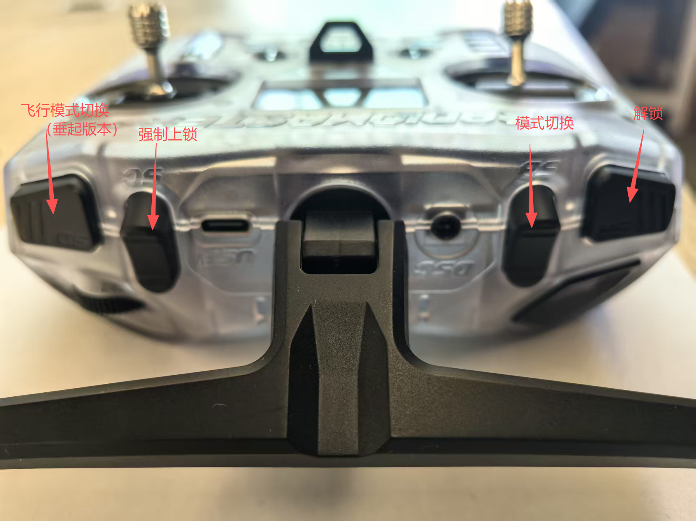
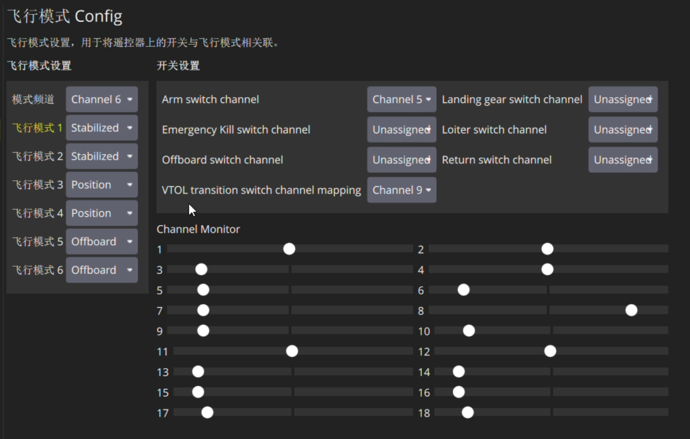
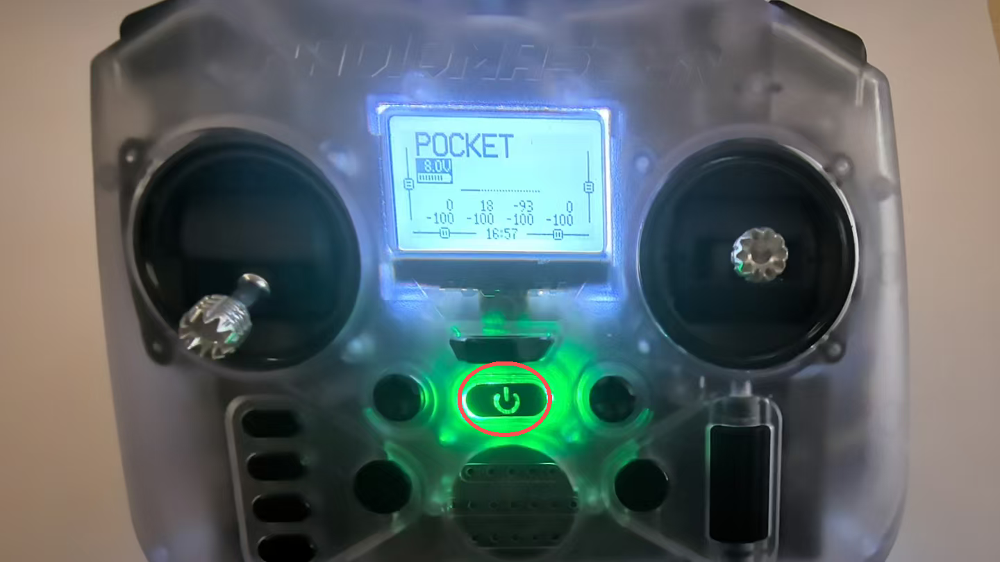
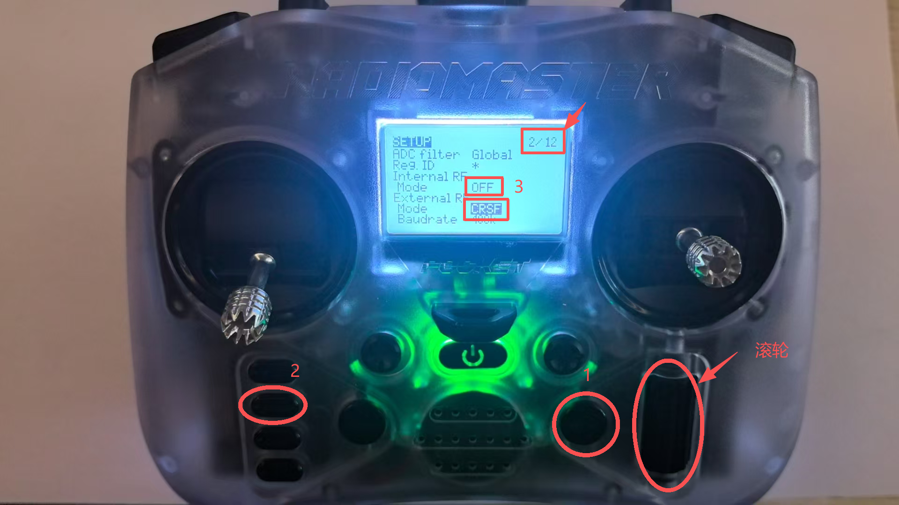

# 准备遥控器

## 遥控器功能




## 拨杆功能设置

遥控器默认为美国手，控制逻辑如下：

*  美国手遥控器控制逻辑示意图
```
┌─────────────────────────────────────────────────┐
│                     遥控器                      │
├─────────────┬───────────────────────────────────┤
│   左摇杆    │               右摇杆              │
├─────────────┼───────────────────────────────────┤
│  ↑ 油门增加 │  ↑       俯仰（机头向下）         │
│  ↓ 油门减少 │  ↓       俯仰（机头向上）         │
│  ← 偏航左转 │  ←          滚转（向左）          │
│  → 偏航右转 │  →          滚转（向右）          │
└─────────────┴───────────────────────────────────┘
```





## 按键功能表

| 按键名称/位置 | 上位 | 中位 | 下位 |
|---------|---------|---------|---------|
| SA | 上锁 | 未启用 | 解锁 |
| SB| 自稳 | 定高 | 定点 |
| SD | 强制上锁 | 未启用 | 未启用 |


# 遥控器对频和协议说明

* 以下说明为遥控器配置介绍，出厂默认已经正确配置，仅仅在使用异常时需要进行配置检查

## 遥控器对频

* 遥控器高频头与接收机出厂时已完成对频，只需确保遥控器已打开外置高频头即可。

* 长按电源键开机。



* 点击右侧“MDL”键， 进入系统菜单，点击左侧第2个翻页按键，到2/12页,滑动滚轮找到外置高频头选项，选择CRSF协议，并确定内置高频头已关闭。

