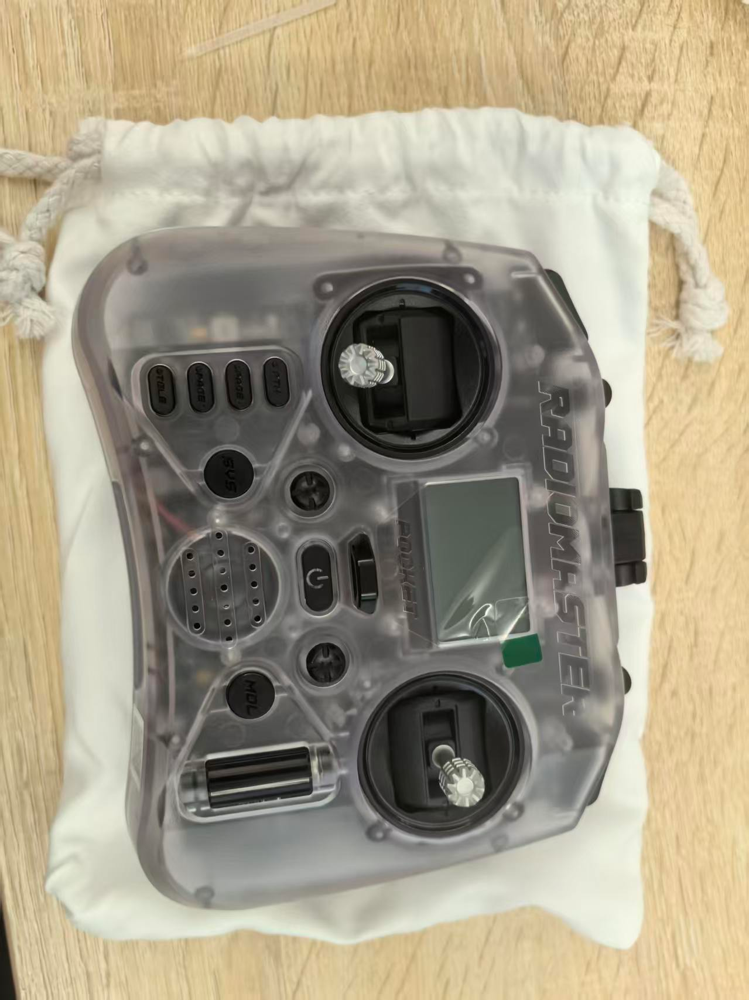

# 开箱组装测试

## 开箱

* 检查产品包装是否完整
* 检查产品包装是否有损坏
* 检查产品包装是否有缺失

## 说明三层泡沫包含的东西

### 第一层泡沫

* 缓冲泡绵

### 第二层泡沫

1. 无人机发货测试清单
2. 无人机桨叶
3. 备用螺丝螺母
4. 机翼固定螺丝
5. 一对机翼

*第二层泡沫中的物品布局*

* 注意无人机尾翼与泡沫方向，避免损坏尾翼

*无人机发货测试清单*

*无人机桨叶四对*

*备用螺丝螺母*

*机翼螺丝*

*无人机机翼一对(注意一手拿住电机，一手拿住机翼，抬出机翼，避免机翼过多受力造成损坏)*

### 第三层泡沫

1.遥控器

2.思翼地面端

3.RTK蘑菇头天线

4.RTK地面端

5.飞控配件盒

6.动力电池*2

7.动力电池充电器

*第三层泡沫中的物品布局*

*无人机遥控器*
打开控包为遥控器主体，控包夹层内含数据线等配件

*飞控配件盒*

*9900mah无人机动力电池 2块*

*动力电池充电器*

*无人机机身主体*

## 组装检查

### *机身主体组装*

* 将机翼碳管对齐插入机身主碳管，注意将快拆头事先穿入机身，将快拆头就近相接

* 最后将机翼插装到位，确认快插头插紧，螺丝孔对齐贯通、无偏移，使用H2.5内六角螺丝刀将机翼固定螺丝拧入对应孔位即完成组装

### 检查

* 取出遥控器，长按遥控器电源键上电

* 使用动力电池给无人机上电，注意电源的XT60接口方向，避免接错，上电后，整理线序，把电池固定到电池仓位（上电后MLRS地面端与天空端自动连接，可选择有线或无线连接方式详情可见[准备通信链路](<准备通信链路.md>)）

* 电池尾部刚好碰到两边机身即可

* 打开QGC地面站，检查无人机是否正常连接

