# **快速飞行**

* 本页面为快速飞行的相关内容，作为飞行前注意事项检查使用，不作为详细教程
* 详细教程请参考其他部分

## **重心配平说明**

### 正确的重心位置

* ⚠️注意：出厂前已配置好重心位置，无需额外操作。如果添加其他设备，需要重新考虑重心

### 配平注意事项

- **重量分布**：确保所有设备和载荷均匀分布，避免单侧偏重
- **电池位置**：电池通常是无人机的主要重量来源，其位置对重心影响显著

* 对于 SwiftWing S6 VTOL 无人机，推荐的重心位置为下图所示两侧标记位置

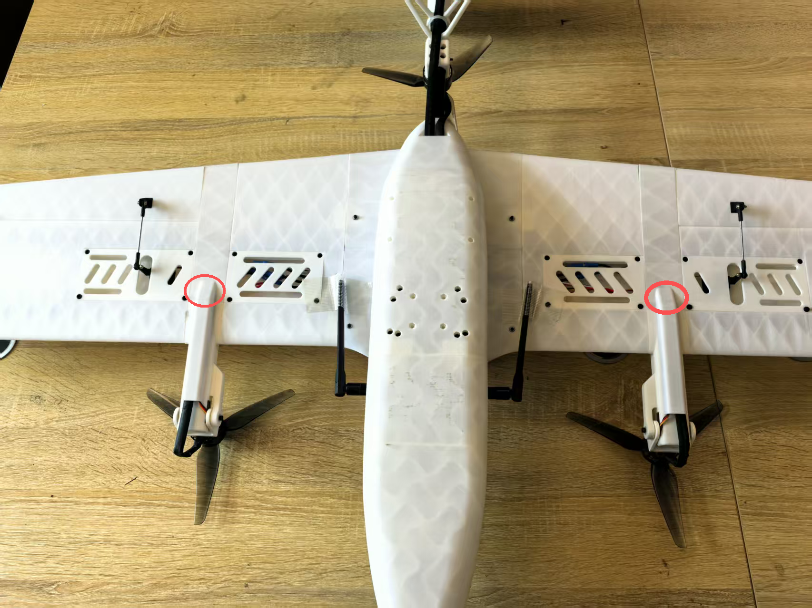

* 双手支撑重心位置，机头由水平方向变为微微前倾即可

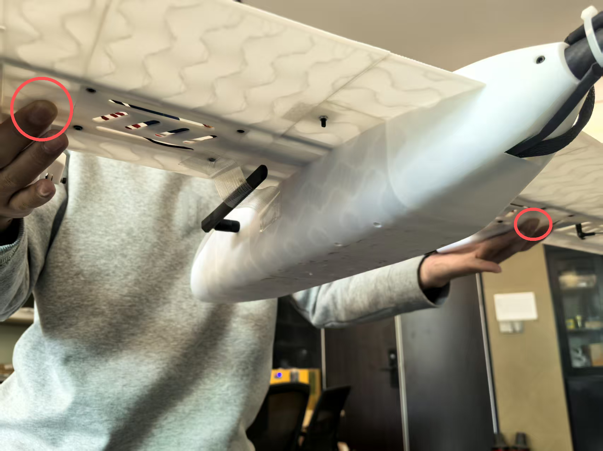

## **一、地面测试前的设备准备**

* 需准备以下设备：
  1. 遥控器
  2. 思翼通讯链路地面端
  3. elrs接收机
  4. 思翼通讯链路网线
  5. 8800毫安动力电池
  6. RTK基站
  7. 笔记本电脑

## **二、起飞前地面传感器校准**

* 传感器校准说明：
  1. 校准罗盘：新场地建议校准，旧场地没有报错提示可不校准
  2. 校准空速：飞行前校准
  3. 其他传感器：没有报错提示，可不校准

### 开始传感器校准

#### 校准罗盘

* 在QGC软件中点击传感器设置，点击罗盘，点击OK，开始校准罗盘

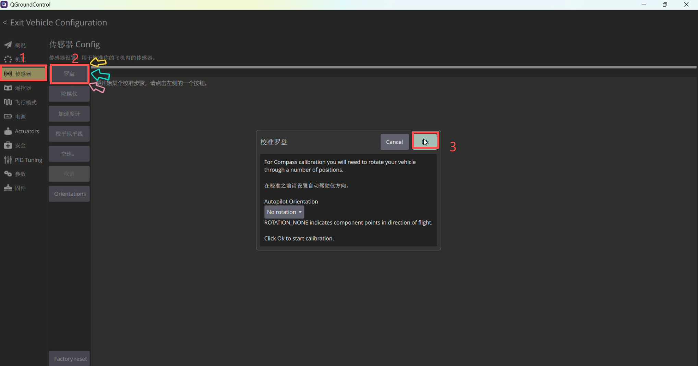

* 红色方框变成黄色后，说明检测到当前姿态，即可逆时针转动无人机，至完成当前姿态校准，然后依次完成其余姿态校准。

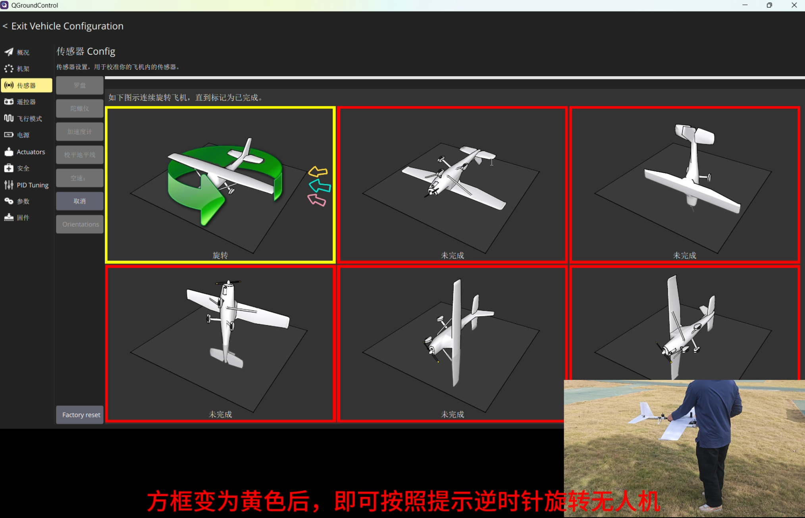

* 校准完成后需拔电重启飞行器，才能正常使用

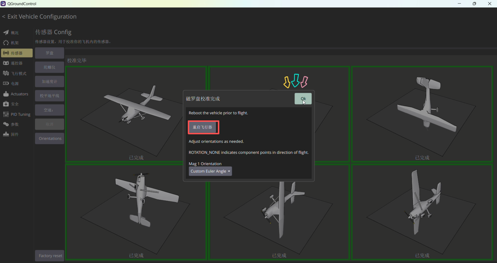

#### 校准空速

* 进行空速的校准前，需要先用手挡住空速管，然后点击空速校准

吹气注意事项
1、深吸一口气，吹气方向正对空速管的动压孔；
2、距离空速管的动压孔 3-5cm，均匀、缓慢、持续向前吹气；
3、如果失败可以多次尝试。
*[cal] calibration started: airspeed*     校准已启动：空速
*[cal] Ensure sensor is not measuring wind*     确保传感器未在测量风速

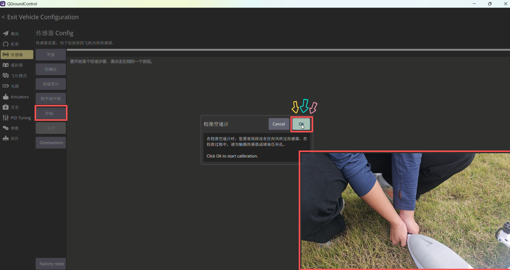

* *[cal] Blow into front pitot without touching*    出现语音提示，对空速管吹气
* *[cal] calibration done: airspeed*     校准已完成：空速

## **三、起飞前舵面偏转测试说明**

- 起飞前需确认固定翼模式下舵面的偏转方向正确，避免出现控制出错。一般情况下，飞机整机安装完成后，且未拆装机体、未更改遥控器配置或飞控的 actuator 参数，无需重复测试。**但如果发生以下任一情况，必须重新进行地面测试**：
  - 飞控重新接线；
  - 修改遥控器相关配置；
  - 调整飞控中 actuator 相关参数。

 **倾转电机摆动方向检测（旋翼模式）**

* 油门保持最低，在旋翼的自稳模式下，解锁无人机；
* 向左推动偏航杆，右倾转电机向前微微倾转；

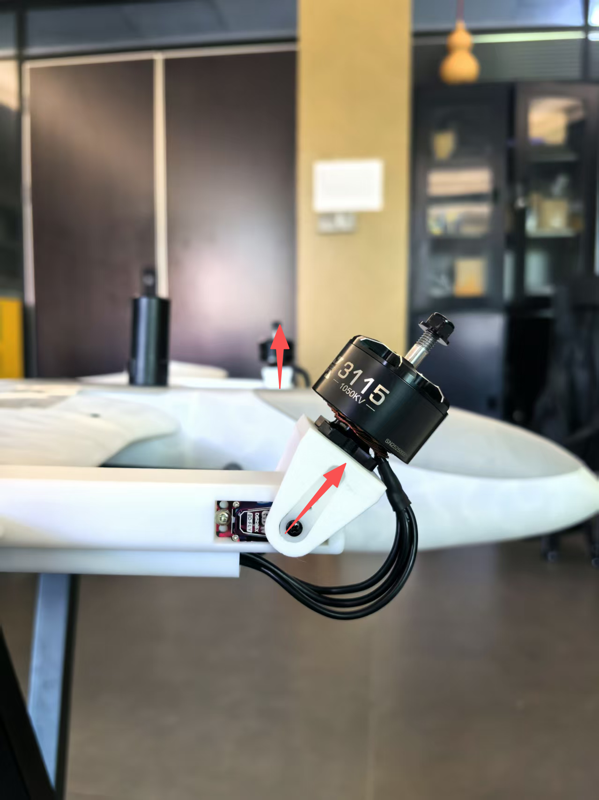

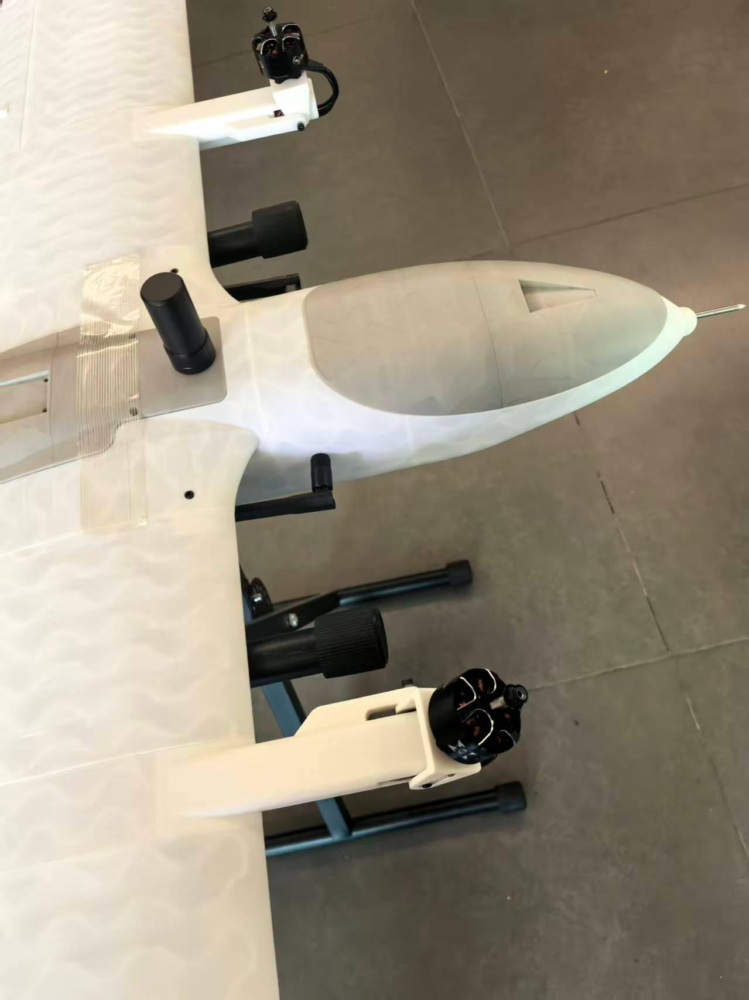

* 向右推动偏航杆，左倾转电机向前微微倾转；

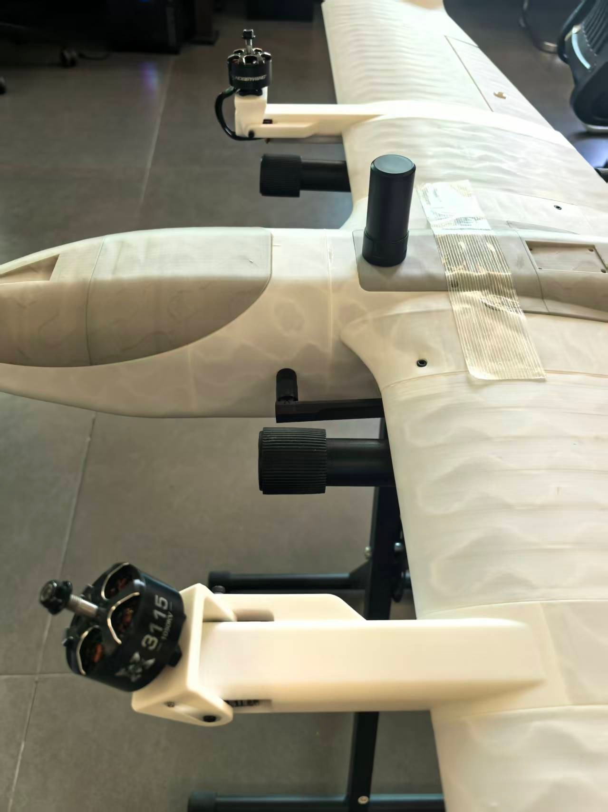

- **固定翼模式切换检测**
  * 油门保持最低，在旋翼的自稳模式下，解锁无人机，然后拨动飞行模式转换开关，切换至“固定翼模式”。此时，两个倾转电机将快速切换至水平。

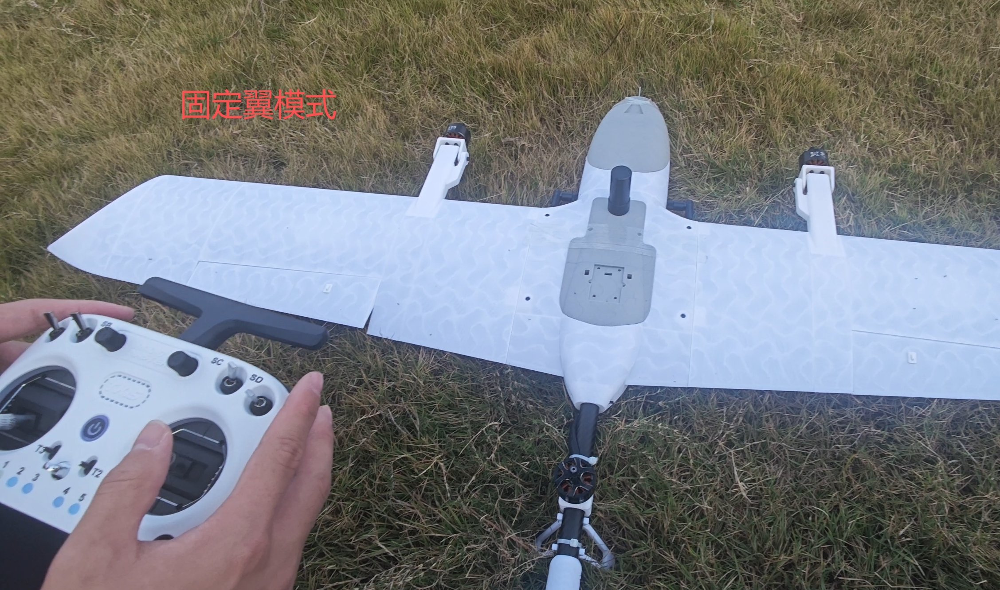

- **舵面动作检测（固定翼模式）**

  * 切换至固定翼模式后，将油门收至0位。维持“自稳模式”，操作遥控器检查各舵面动作：
    * 模拟飞机飞行姿态，向右倾斜时，自稳模式下舵面为左副翼向上右副翼向下，有让飞机姿态能够回中的趋势

* 模拟飞机飞行姿态，向左倾斜时，自稳模式下舵面为左副翼向下右副翼向上，有让飞机姿态能够回中的趋势

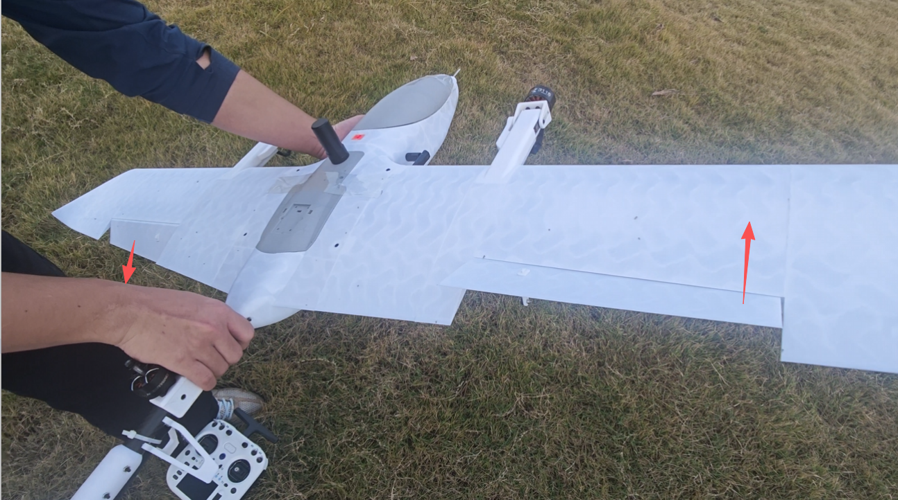

* 机头上翘，升降舵舵面应为向下。

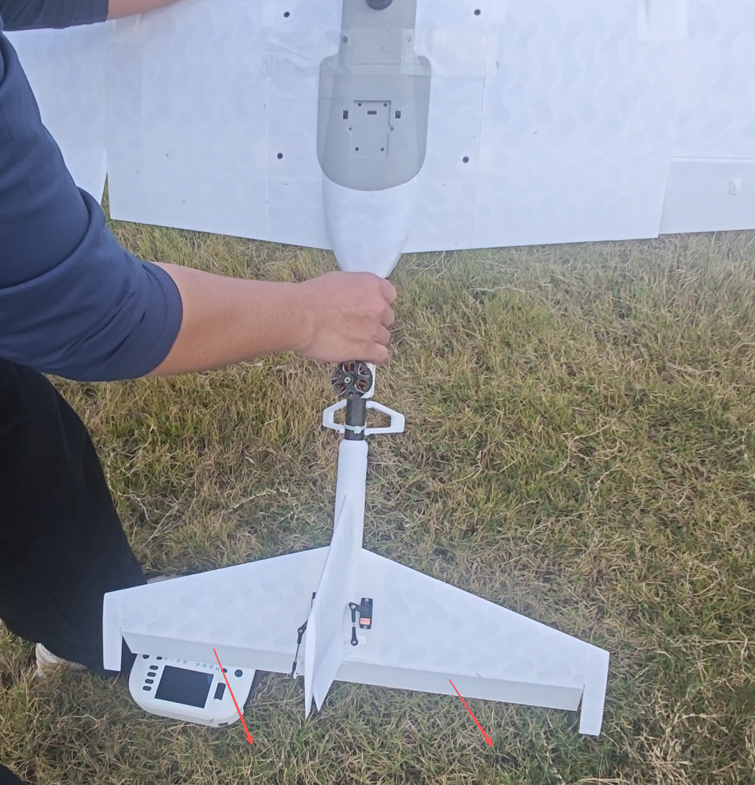

* 机头向下，升降舵舵面应为向上。

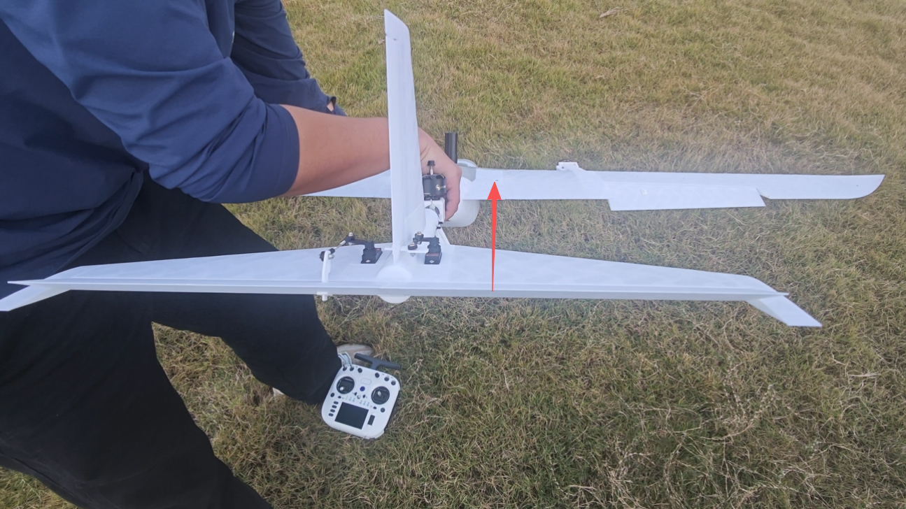

- 向左打副翼杆，检查副翼舵面为左副翼向上、右副翼向下；

- 向右打副翼杆，检查副翼舵面为右副翼向上、左副翼向下；

* 向上打俯仰杆，检查升降舵舵面向下；
* 向下打俯仰杆，检查升降舵舵面向上。

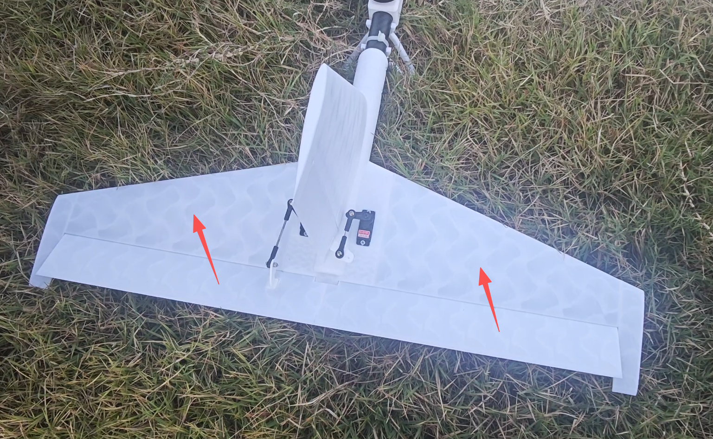

* 向左打偏航杆，检查方向舵舵面向左偏转；
* 向右打偏航杆，检查方向舵舵面向右偏转。

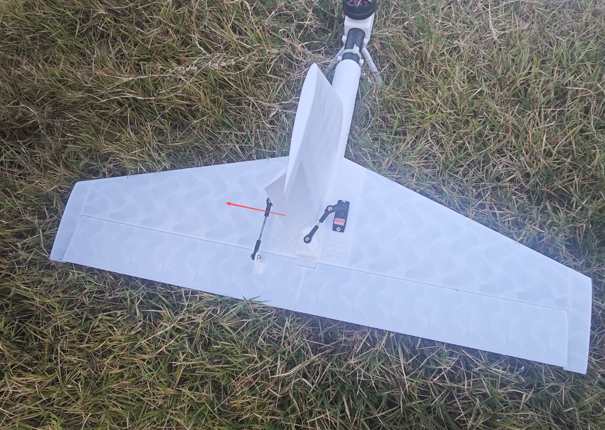

## 四、解锁起飞

* 检查无人机重心是否正确，参考最前方的重心配平说明
* 重心正确无误后，在旋翼的定点模式下解锁起飞

* 控制程序正常运行，飞手控制无人机飞到合适的高度和朝向,就可以切入 OFFBOARD 模式，响应控制程序的指令了,切入 OFFBOARD 模式后，飞手持续关注无人机飞行状态即可，可以持续观察右边控制指令和左边飞行轨迹

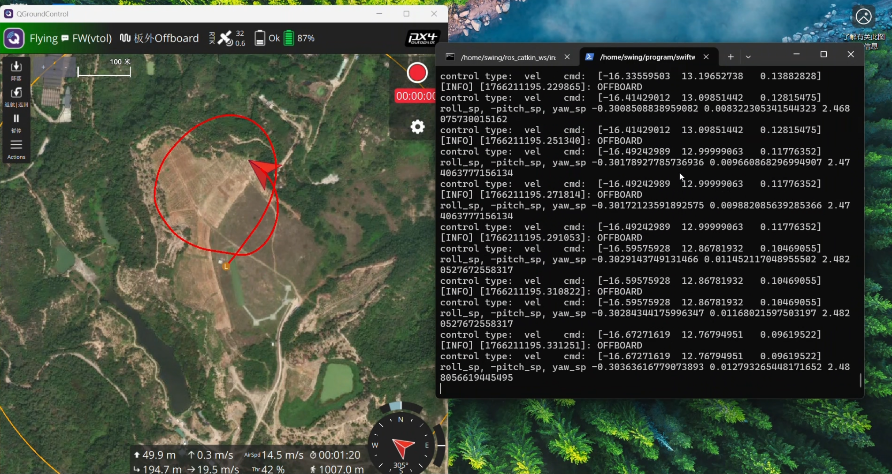

## 五、整理设备

1. 先断开无人机电源
2. 关闭遥控器
3. 关闭地面电脑设备
4. 打包收拾设备即可完成飞行任务
