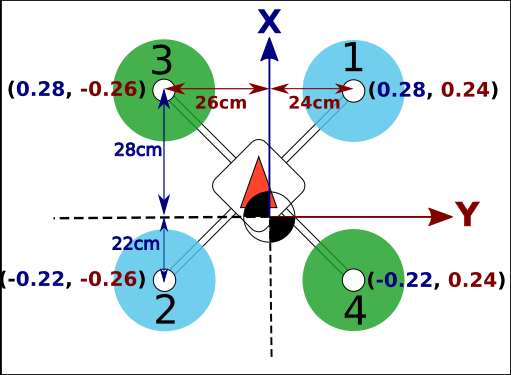
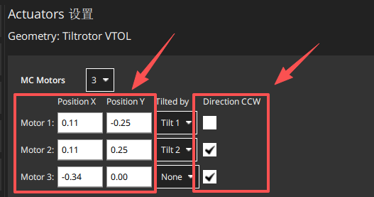
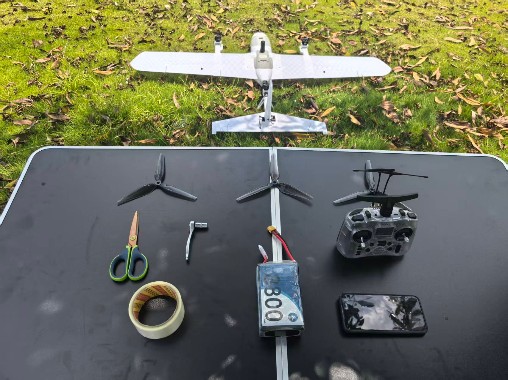
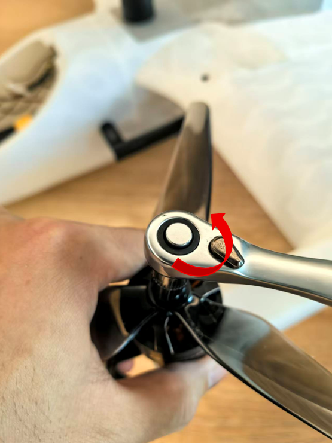

# **起飞前舵面偏转测试说明**

- 起飞前需确认固定翼模式下舵面的偏转方向正确，避免出现控制出错。一般情况下，飞机整机安装完成后，且未拆装机体、未更改遥控器配置或飞控的 actuator 参数，无需重复测试。**但如果发生以下任一情况，必须重新进行地面测试**：
  - 飞控重新接线；
  - 修改遥控器相关配置；
  - 调整飞控中 actuator 相关参数。

## **重心配平**

### 重心配平的重要性

重心配平是无人机飞行前的关键检查步骤，直接影响飞行稳定性和操控性：

- **飞行稳定性**：正确的重心位置确保无人机在飞行过程中保持稳定的姿态
- **操控响应**：合适的重心分布使无人机对操控指令的响应更加灵敏和准确
- **安全性**：避免因重心偏移导致的失控风险
- **燃油效率**：优化的重心位置可减少飞行阻力，提高续航能力

### 正确的重心位置

* ⚠️注意：出厂前已配置好重心位置，无需额外操作。如果添加其他设备，需要重新考虑重心
* 对于 SwiftWing S6 VTOL 无人机，推荐的重心位置为下图所示两侧标记位置

### 重心配平方法

1. **准备工作**

   - 确保无人机处于装配完成状态，包括安装电池、 payload 等所有必要设备
2. **配平步骤**

   - **固定翼模式配平**：
     1. 双手托住无人机的配平参考点，检查无人机是否保持水平
     2. 若机头下沉，说明重心偏前，需要将电池或重物向后调整
     3. 若机尾下沉，说明重心偏后，需要将电池或重物向前调整
3. **检查验证**

   - 重复配平过程 2-3 次，确保结果一致
   - 在不同负载情况下重新进行配平

### 配平注意事项

- **重量分布**：确保所有设备和载荷均匀分布，避免单侧偏重
- **电池位置**：电池通常是无人机的主要重量来源，其位置对重心影响显著

## **电机位置和坐标系说明**

* PX4电机坐标系说明如下（只参考X、Y轴正负方向，不参考电机号位）
  * X轴正方向：指向无人机前方
  * Y轴正方向：指向无人机右侧

* 下图为Vtol S6的电机位置和坐标配置
  * 俯视图看Y3电机位置
  * 1号电机在左副翼，在飞控中心的(0.11,-0.25)位置，并且是顺时针旋转
  * 2号电机在右副翼，在飞控中心的(0.11,0.25)位置，并且是逆时针旋转
  * 3号电机在尾碳管，在飞控中心的(-0.34,0.0)位置，并且是逆时针旋转

## **地面测试前的设备准备**

* 需准备以下设备：
1. MLRS高频头
2. 遥控器、接收机
3. VtolS3无人机主体
4. 无人机电池
5. 电脑

* 将MLRS高频头插入遥控器高频头槽位，通过蓝牙和手机连接，打开手机地面站。详情请看[蓝牙连接](准备通讯链路（无线连接）.md) 

## **起飞前地面传感器校准**

* 传感器校准说明：
  1. 校准罗盘：新场地建议校准，旧场地没有报错提示可不校准
  2. 校准空速：飞行前校准
  3. 其他传感器：没有报错提示，可不校准
**详情可见**[APM飞控教程](APM飞控教程.md)      [PX4飞控教程](PX4飞控教程.md)

## **详细检查步骤：**

- **卸下螺旋桨（断电状态下操作）**

  * 首先，在确保无人机断电的前提下，使用M8套筒或老虎钳卸下电机螺丝，依次拆除三个螺旋桨。

- **上电并检查倾转电机复位**

  1. 将无人机固定放置于测试架上，并接通电源。上电后，双倾转电机应自动复位至垂直位置。
  2. 过程中倾转舵机若有电流声属正常现象（舵机存在微小受力时，即会发出此声音），所用倾转舵机为高扭矩1 0kg级别。
- **检查电机转向（自稳模式）**

  1. 使用遥控器将飞行模式切换至“自稳模式（Stabilize）”，解开油门锁并后，按下解锁按钮。
  2. 缓慢推动油门，电机轻声转动即可，主要检查各电机的转向是否正确：

  * 从俯视角看，左前电机应顺时针旋转；
  * 右前电机与尾部电机应逆时针旋转。

- **倾转电机摆动方向检测（旋翼模式）**
* 油门保持最低，在旋翼的自稳模式下，解锁无人机；
* 向左推动偏航杆，右倾转电机向前微微倾转；

* 向右推动偏航杆，左倾转电机向前微微倾转；

- **固定翼模式切换检测**
  * 油门保持最低，在旋翼的自稳模式下，解锁无人机，然后拨动飞行模式转换开关，切换至“固定翼模式”。此时，两个倾转电机将快速切换至水平。

- **舵面动作检测（固定翼模式）**

  * 切换至固定翼模式后，将油门收至0位。维持“自稳模式”，操作遥控器检查各舵面动作：
    * 模拟飞机飞行姿态，向右倾斜时，自稳模式下舵面为左副翼向上右副翼向下，有让飞机姿态能够回中的趋势

* 模拟飞机飞行姿态，向左倾斜时，自稳模式下舵面为左副翼向下右副翼向上，有让飞机姿态能够回中的趋势

* 机头上翘，升降舵舵面应为向下。

* 机头向下，升降舵舵面应为向上。

- 向左打副翼杆，检查副翼舵面为左副翼向上、右副翼向下；

- 向右打副翼杆，检查副翼舵面为右副翼向上、左副翼向下；

* 向上打俯仰杆，检查升降舵舵面向下；
* 向下打俯仰杆，检查升降舵舵面向上。

* 向左打偏航杆，检查方向舵舵面向左偏转；
* 向右打偏航杆，检查方向舵舵面向右偏转。

