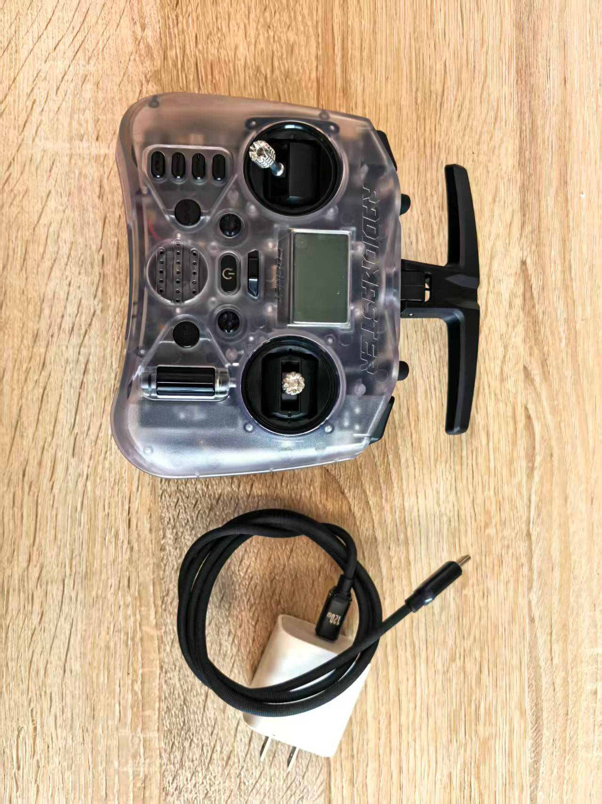
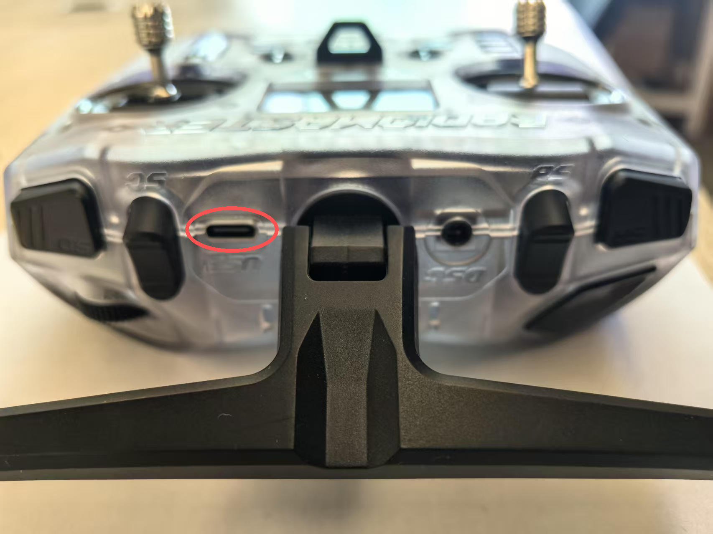
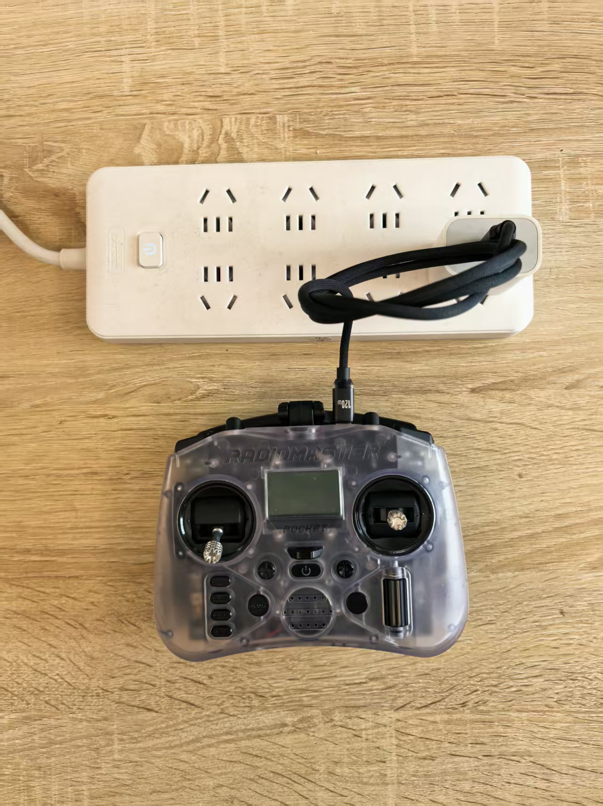
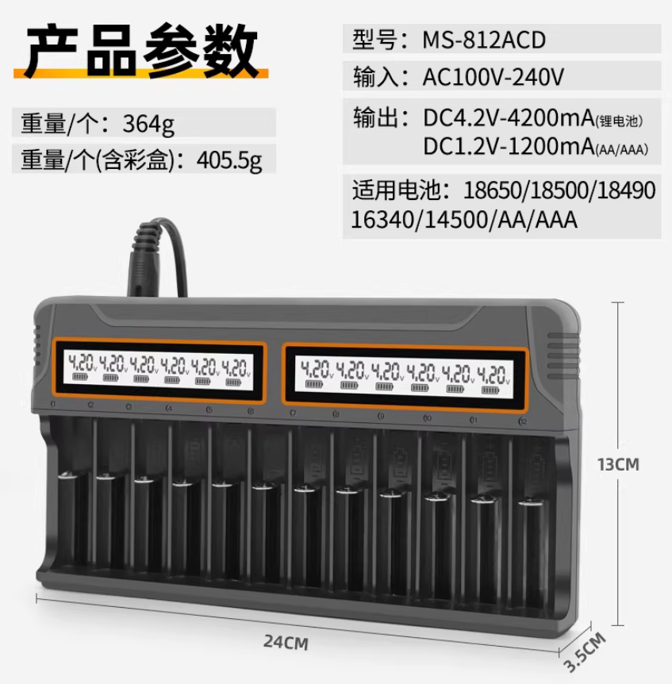

# Poket遥控器充电

* Poket遥控器官方文档：[Poket_manual_V1.2.pdf](https://cdn.shopify.com/s/files/1/0609/8324/7079/files/Pocket_1.pdf?v=1736839330)

* 若使用官方电池仓配合18650电池使用，推荐使用遥控器USB—C充电接口进行充电（充电线和插头规格 不做要求），也可使用18650充电器进行充电
  若使用带电源头的锂聚合物电池（2S），也可使用航模充电器进行充电

* 18650电池充电器

# 电源和充电注意事项

* TX15内置USB-C充电功能，适用于2节3.7V锂电池。充电电路仅支持2节3.7V锂离子
  18650 电池或2节7.4V锂聚合物电池（2S）。电池标称电压为3.7V，满电电压为4.2V/节。
* 请勿使用LiFe磷酸铁锂电池或3.6V标称、4.10V满电的18650电池。使用不兼容电池可能导致损坏或起火。
* 如使用锂离子电池，请确保使用无保护板、尖头18650电池。
* 请定期检查电池电压和状态，并切勿无人看管充电。务必在远离易燃物的安全环境下充电。
  如遥控器受潮或受损，请勿进行充电，亦不得反接极性。
* RadioMaster不对因产品误用或不当操作造成
  的后果承担任何责任。
