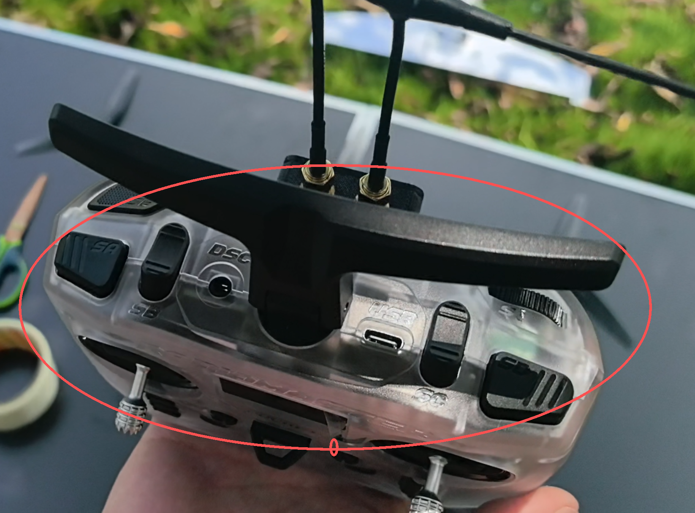
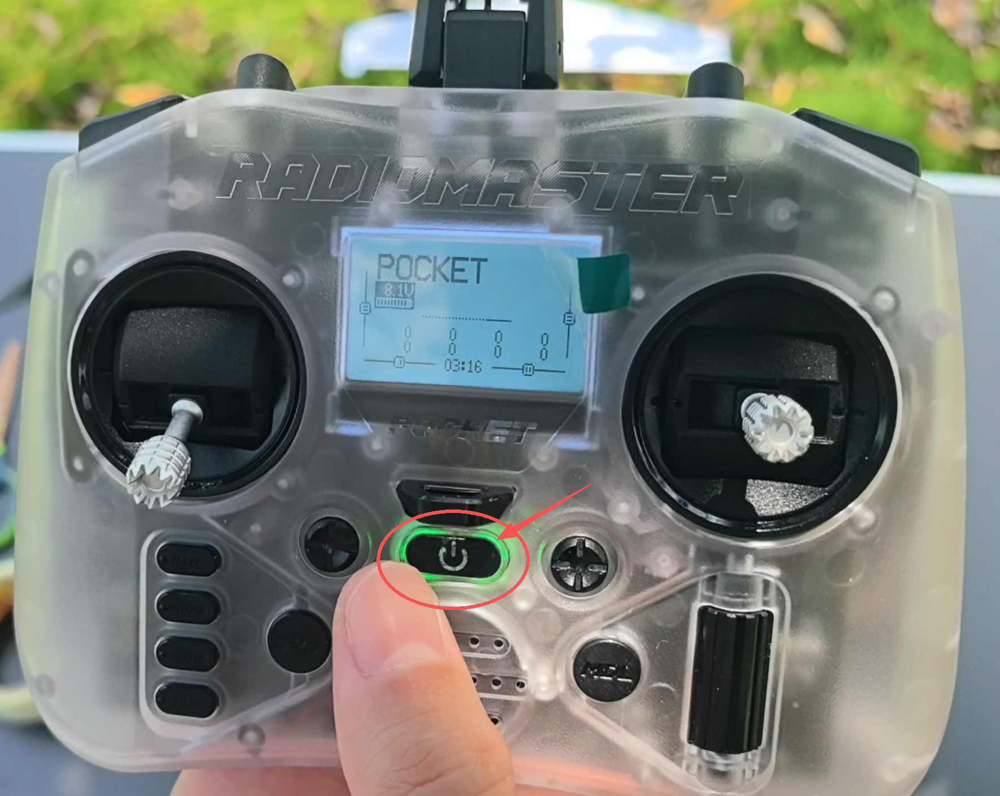
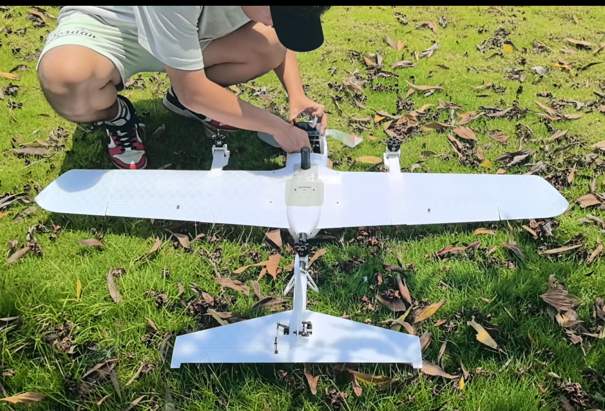
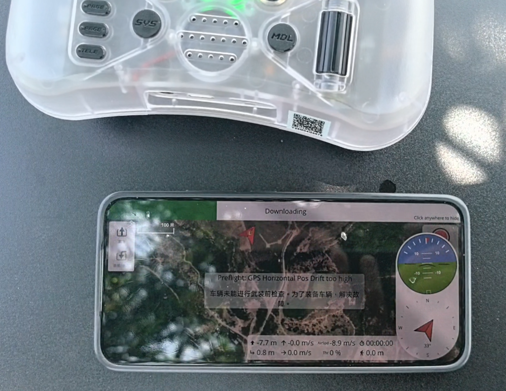
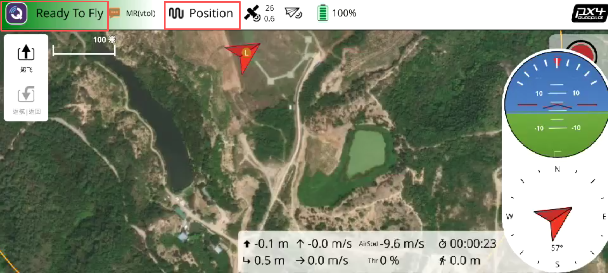
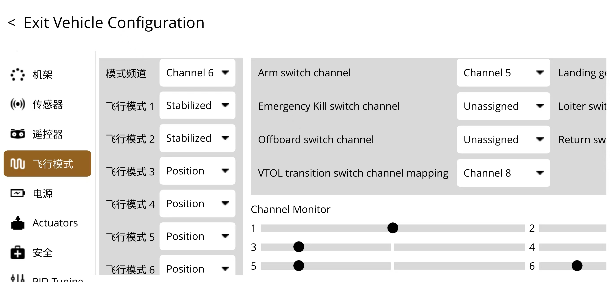
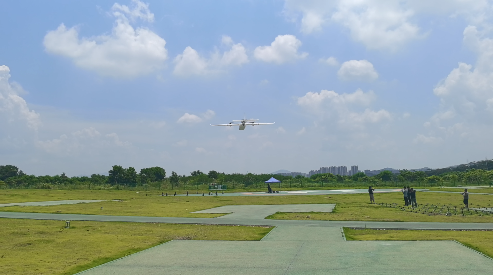
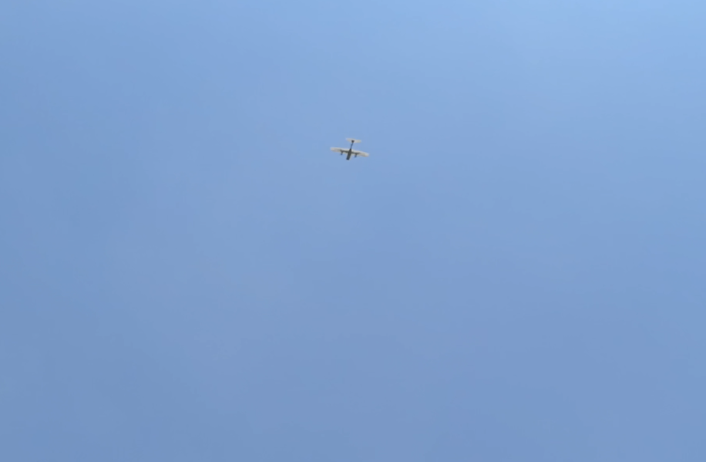
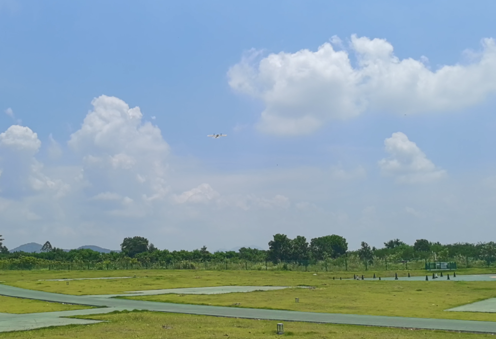
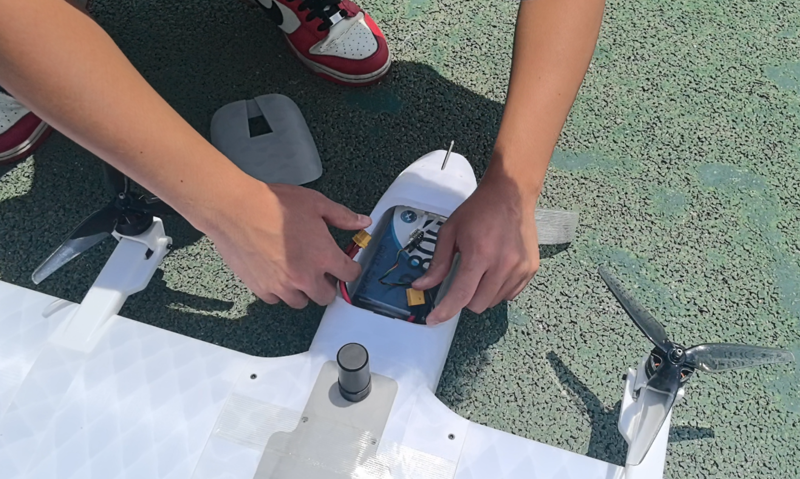

# 完整飞行演示

## 准备阶段

1. 确认电池电量充足
2. 用纤维胶带将飞机舱盖粘好防止意外脱落

3. 长按电源键遥控器开机。遥控器拨杆按键归于初始位置，开启遥控器将不会有报错提示。

4. 给飞机上电，在飞机未上桨的情况下准备进行起飞前地面测试，详情请参考[起飞前地面测试](起飞前地面测试.md)

5. 蓝牙连接手机地面站（参数加载进度条加载完成一般不会超过一分钟），查看飞机状态是否正常，确认地面站出现Ready to fly"，可在“Position（定点）”模式下起飞。

* 检查VtolS6飞行状态，提示Ready To Fly则说明状态正常

* 飞行前需对遥控器按键功能设置有基本了解，请看[拨杆功能设置](准备遥控器.md)

## 飞行阶段

6. 准备工作完成后，定点旋翼模式起飞。

7. 飞行至30米高度左右，飞机对向逆风方向，按下VTOL切换按键进入过渡模式向前加速，达到设置空速后完全切换至固定翼模式。

8. 定点固定翼模式飞行：倾转电机向前，尾电机停转

9. 降落阶段：油门收至中位，按下VTOL切换按键切换至旋翼模式降落：倾转电机向上，尾电机开始旋转。（建议飞行阶段全程保持定点模式飞行）

10. 油门拉到最低，电机进入怠速模式，遥控器上锁。降落后，拔下电池回收飞机

